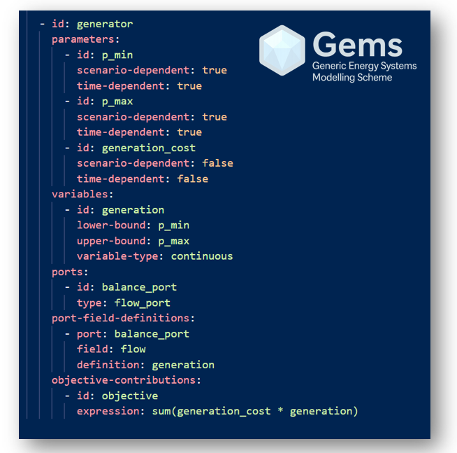

    

# What is GEMS?

**GEMS** is a high-level modelling language, close to mathematical syntax, and a data structure for describing energy systems. Compared to other algebraic modelling languages, **GEMS** is object- and graph-oriented, making it particularly well-suited to representing energy systems.
 

# Vision and Ambitions for GEMS

The ambition behind the GEMS language is to **build and support a community of energy modellers and energy foresight practitioners** who can easily share models, assumptions, and studies.
This approach is particularly important as future energy systems — strategic by nature — are increasingly conceived in a **multi-energy, multi-actor landscape**, characterised by rising systemic complexity and tightly coupled interactions across scales.

    

GEMS has the key attributes required to support and sustain such a community.

- **Versatility:** GEMS is a generic optimisation language capable of representing a wide range of energy systems and use cases, from operational studies to long-term planning, across multiple energy carriers and scales.

- **Code Stability and Maintainability:** By clearly **separating model definition from problem resolution**, GEMS promotes robust, modular, and maintainable code that can evolve over time without breaking existing models.

- **Interoperability:** GEMS relies on a **self-contained** and exhaustive mathematical formulation, ensuring that all modelling assumptions, variables, and constraints are explicitly defined. This guarantees unambiguous interpretability of models, which is a key enabler for true interoperability between tools, solvers, and modelling frameworks.

    

 

# Resources

The **GEMS documentation, pre-defined model libraries and quick-start examples** are hosted in the GitHub repository: [GEMS](https://github.com/AntaresSimulatorTeam/Gems)

The following **interpreters** can be used to run Gems modelling language :

- [Antares Simulator](https://github.com/AntaresSimulatorTeam/Antares_Simulator), an open-source power system simulator
- [GemsPy](https://github.com/AntaresSimulatorTeam/GemsPy), a stand-alone Python package, maintained for prototyping purposes

**Converters** are available to translate existing studies into the GEMS modelling language:

- [Antares Legacy Models to GEMS Converter](https://github.com/AntaresSimulatorTeam/AntaresLegacyModels-to-GEMS-Converter) : a Python package that enables the migration of Antares Legacy Models to GEMS.
- [PyPSA to Gems Converter](https://github.com/AntaresSimulatorTeam/PyPSA-to-GEMS-Converter), a stand-alone Python package to export PyPSA [Networks](https://docs.pypsa.org/v1.0.2/user-guide/design/#network-object) as [GEMS system](./3_User_Guide/3_GEMS_File_Structure/3_system.md). This converter supports [PyPSA two-stage stochastic optimization problems](https://docs.pypsa.org/v1.0.2/user-guide/optimization/stochastic/): such problems can be addressed by GEMS [interpreters](./1_Overview/1_Architecture.md) and solved with [Antares Xpansion's Benders decomposition algorithm](https://antares-xpansion.readthedocs.io/en/stable/).

<h2 align="center">🌐 <a href="https://gems-energy.readthedocs.io/en/latest/">Visit Website</a></h2>
