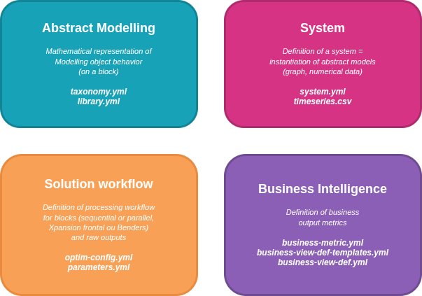

  

    <a href="../../index.md">Main Section</a>
  

  

    
  

# GEMS Architecture

## Architectural Breakthrough

This architecture represents a fundamental change from classical OOME architectures (Object-Oriented Modelling Environment), where mathematical models are typically hard-coded in the software itself.

  

This architecture aims to export the definition of component models and system configuration from the core software, by relying on **external YAML files**, which enables:

- **Flexible modelling:** Models and system configurations can be defined, extended, or modified directly in configuration files—no changes to the core code are required.
- **Interoperability:** The GEMS file format supports seamless integration with external tools and workflows, such as converting and simulating PyPSA studies using GemsPy.

## Domains

The GEMS architecture enforces a structured approach, separating modelling logic, system configuration, optimization workflow, and business intelligence into four distinct "bounded domains" (see the following definition diagram):

Users primarily interact with GEMS by defining the **system to be simulated or optimized** through external configuration files that describe components, constraints, and operating conditions.
During execution, an internal process may automatically construct an optimization problem from this system description and pass it to an external solver when required, but this remains an implementation detail rather than the primary user concern.

## Inputs

These inputs are external files to the core software and consist of:

| **Type of Input**   | **Domain**  | **File**        | **Description & Role**  |
|---------------------|-------------|-----------------|-------------------------|
| **Model Libraries** | Abstract modelling | YAML (e.g., `basic-models-library.yml`, `antares-models-library.yml`)  |**Defines Models:** Abstract representations of system components to be simulated. **Models are defined in a library file** and specifies its ports, parameters, and internal behavior.These definitions can also include optional constraint and objective contributions used later during simulation. |
| **System**  | System  | YAML  (`system.yml`) | **Defines Components:** Numerical instantiation of models, linking to model IDs (e.g., `example_library_id.example_model_id`). Specifies parameter values and connections between components via ports, forming the system graph. |
| **Timeseries**  | System  | Dataseries (e.g., `wind_generation.csv`, `solar_generation.csv`)  | **Time-dependent Data:** Numerical data for parameters varying by time and scenario. Stored as `.csv` or `.tsv` files, typically in a data-series folder.  |
| **Taxonomy**             | Abstract modelling        | YAML (e.g., `taxonomy.yml`)                | **Model Structure & Categories:** Specifies mandatory parameters, variables, ports, or extra outputs per category. Useful for structuring the UI (user interface) and simulation outputs.                             |
| **Solution Workflow**    | Solution Workflow        | YAML (`optim-config.yml`)            | **Workflow Definition:** Describes calculation block processing (sequential, parallel, Xpansion frontale, Benders decomposition) and master problem constraints, especially for investment variables.                   |
| **Business Views**       | Business Intelligence    | YAML (e.g., `business-view-def.yml`, `business-metric.yml`) | **Business Metrics Logic:** Calculates business metrics from simulation results in two phases: Step 1 (component scope, complex arithmetic), Step 2 (global scope, aggregation/filtering).                             |
| **Parameters**           | System                   | YAML (`parameters.yml`)              | **Solver & Configuration Settings:** Contains solver parameters and configuration required for running Modeler.                                                                                                |

## Files Interaction

The following scheme shows the interaction of the different core concepts presented previously. It is based on the [*basic-model-library*](../../../libraries/basic_models_library.yml) included in this documentation.

    

---

**Navigation**

  

  <button type="button" style="background-color:#CCCCCC; border:none; padding:8px 16px; border-radius:4px; cursor:pointer">
    <a href="../Home/Main_Home/2_release_notes.md" style="text-decoration:none; color: #000000">⬅️ Previous page</a>
  </button>
  

  <button type="button" style="background-color:#AAAAFF; border:none; padding:8px 16px; border-radius:4px; cursor:pointer">
    <a href="../../index.md" style="text-decoration:none; color: #FFFFFF">Index</a>
  </button>
  

  <button type="button" style="background-color:#CCCCCC; border:none; padding:8px 16px; border-radius:4px; cursor:pointer">
    <a href="2_core concepts.md" style="text-decoration:none; color: #000000">Next page ➡️</a>
  </button>
  

---

© GEMS (LICENSE)