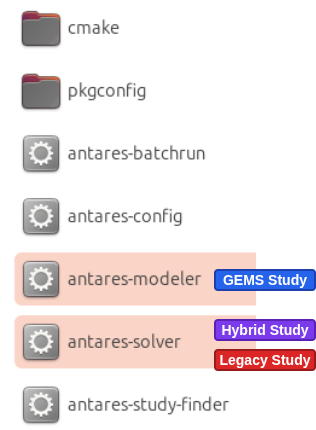

  

    <a href="../../../..">Main Section</a>
  

  

    
  

# Antares Modeler

This section outlines the approach for configuring and utilizing the **Antares Modeler**, the interpreter for the **GEMS language** inside [Antares Simulator](https://github.com/AntaresSimulatorTeam/Antares_Simulator).

## Installation

Note that the current **last stable version** of Antares Simulator is [**9.3.2**](https://github.com/AntaresSimulatorTeam/Antares_Simulator/releases/tag/v9.3.2).

Download [**Antares-Simulator**](https://github.com/AntaresSimulatorTeam/Antares_Simulator/releases) from the official releases page, then locate the **Antares Modeler executable** in the installation’s bin folder, noting that it is currently a command-line–only tool with no graphical interface yet.
Inside this bin folder, the **Antares Solver executable** is also present to run a study in Antares legacy mode.
However, **Antares Modeler** is able to [tackle an **hybrid** study](../3_User%20Guide/3_hybrid%20inputs.md) (made from legacy and GEMS models).

## Requirements

The **Antares Modeler** is designed to function within the Antares Simulator ecosystem. Therefore, it is necessary to **install Antares Simulator**.

The complete installation, documentation is available on the [official documentation website](https://antares-simulator.readthedocs.io/en/latest/user-guide/02-install/).

In addition, Antares Modeler requires a `parameters.yml` file to run a GEMS study. , and the process for creating this file is detailed in [this section](../3_User%20Guide/2_inputs.md). Unlike the GEMSPy interpreter, Modeler depends on this configuration file.

## Additional Resources

| Resource                | Link                                                                 |
|-------------------------|----------------------------------------------------------------------|
| Antares Simulator GitHub | [Antares Simulator on GitHub](https://github.com/AntaresSimulatorTeam/Antares_Simulator) |
| Online Documentation     | [Antares Simulator Docs](https://antares-simulator.readthedocs.io/en/latest/) |
| Modeler Documentation    | [GEMS Modeler Docs](https://antares-simulator.readthedocs.io/en/latest/user-guide/modeler/01-overview-modeler/) |
| Examples                 | See the repository's `examples/` directory                           |
| FAQ                      | [FAQ](../../6_Support%20&%20Contributing/1_faq.md)                   |
| GitHub Issues            | [Antares Simulator Issues](https://github.com/AntaresSimulatorTeam/Antares_Simulator/issues) |
| Contact Support          | [Contact support](../../6_Support%20&%20Contributing/2_contact.md)   |

---

**Navigation**

  

  <button type="button" style="background-color:#CCCCCC; border:none; padding:8px 16px; border-radius:4px; cursor:pointer">
    <a href="../../1_Overview/References/4_Users" style="text-decoration:none; color: #000000">⬅️ Previous page</a>
  </button>
  

  <button type="button" style="background-color:#AAAAFF; border:none; padding:8px 16px; border-radius:4px; cursor:pointer">
    <a href="../../../.." style="text-decoration:none; color: #FFFFFF">Index</a>
  </button>
  

  <button type="button" style="background-color:#CCCCCC; border:none; padding:8px 16px; border-radius:4px; cursor:pointer">
    <a href="../1B_gemspy_installation" style="text-decoration:none; color: #000000">Next page ➡️</a>
  </button>
  

---

© GEMS (LICENSE)