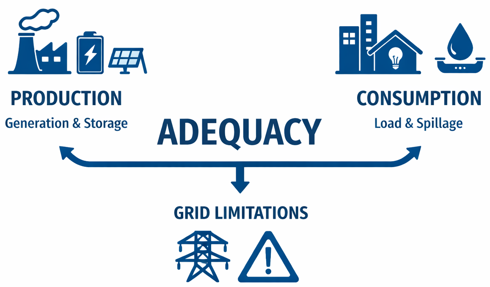
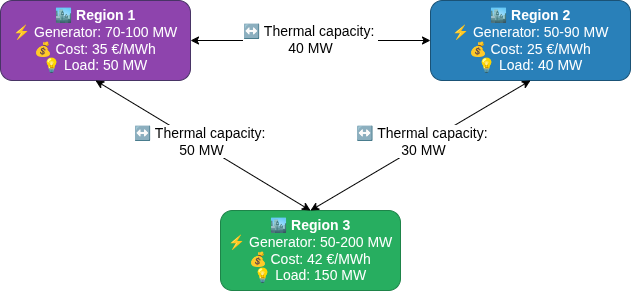

<div style="display: flex; justify-content: space-between; align-items: center;">
  <div style="text-align: left;">
    <a href="../../../..">Main Section</a>
  </div>
  <div style="text-align: right;">
    
  </div>
</div>


# QSE 1 : Three-Bus Adequacy System

## Overview
This tutorial demonstrates adequacy modeling in a meshed three-bus network. Unlike the previous two-bus example, a three-bus system allows us to illustrate **Kirchhoff's Second Law** (loop flows) and network effects that cannot be shown with only two nodes.

### Adequacy definition

**Adequacy** is the ability of the electric grid to satisfy the end-user power demand at all times. The main challenge is to get the balance between the electric **Production** (generator, storage) and **Consumption** (load, spillage) while respecting the **limitations of the grid**.



## Files Structure
```
tutorial_QSE_adequacy/
├── input/
│   ├── library.yml
│   ├── system.yml
│   └── data-series/
│       └──  ...
└── parameters.yml
```
## Problem Description

### Network
**Components:**

- 3 Buses (Regions 1, 2, 3 forming a triangle)
- 3 Links (connecting each pair of regions)
- 3 Generators (different capacities and costs)
- 3 Loads (fixed demands)

**Time Horizon:** 1 hour is used for this example



In this example, `power flow` is constrained only by thermal capacities


## Step 1: Library File

Use `basic_models_library.yml` from the [libraries folder](https://github.com/AntaresSimulatorTeam/GEMS/blob/main/libraries/basic_models_library.yml)

## Step 2: System File

- Creation of `system.yml` file

This system models a three-bus network with the following characteristics:

**Network Topology:**

- 3 interconnected buses forming a triangular mesh network
- 3 bidirectional transmission links connecting each pair of buses

**Generation:**

- Generator 1 (Bus 1): 70-100 MW capacity, 35 $/MWh cost
- Generator 2 (Bus 2): 50-90 MW capacity, 25 $/MWh cost
- Generator 3 (Bus 3): 50-200 MW capacity, 42 $/MWh cost

**Demand:**

- Bus 1: 50 MW
- Bus 2: 40 MW
- Bus 3: 150 MW
- **Total Load: 240 MW**

**Transmission Capacities:**

- Link 1-2: 40 MW (bidirectional)
- Link 2-3: 30 MW (bidirectional)
- Link 3-1: 50 MW (bidirectional)

**Economic Parameters:**

- Spillage cost: 1000 $/MWh (penalty for wasted energy)
- Unsupplied energy cost: 10000 $/MWh (high penalty for unmet demand)

**Expected Dispatch:**

Given the generator costs (Generator 2 is cheapest at 25 $/MWh), the optimizer will prioritize Generator 2, then Generator 1, and finally Generator 3 as needed to meet the total demand of 170 MW while respecting transmission constraints.

## How to run the study 

### By using Modeler

1. Get Modeler installed through this [tutorial](../2_Getting%20Started/1_installation.md)
2. Go to the GEMS study folder, open the terminal
3. Type in the terminal `antares-modeler <study_folder>/`

The results will be available in the folder `<study_folder>/output`

# YAML Block Description: Generator

<div style="display: flex;">
<div style="flex: 1; padding: 10px; max-width: 50%;">

```yaml
- id: generator
  parameters:
    - id: p_min
      scenario-dependent: true
      time-dependent: true
    - id: p_max
      scenario-dependent: true
      time-dependent: true
    - id: generation_cost
      scenario-dependent: false
      time-dependent: false
  variables:
    - id: generation
      lower-bound: p_min
      upper-bound: p_max
      variable-type: continuous
  ports:
    - id: balance_port
      type: flow_port
  port-field-definitions:
    - port: balance_port
      field: flow
      definition: generation
  objective-contributions:
    - id: objective
      expression: sum(generation_cost * generation)
```
</div>
<div style="flex: 1; padding: 10px; max-width: 50%">

Parameters:

$$p_{\text{min}} \text{: Minimum production value}$$
scenario and time dependencyscenario and time dependency

$$p_{\text{max}} \text{: Maximum production value}$$
 - scenario and time dependency

$$generation_\text{cost} \text{ : Production cost in the objective function,}$$
 - No scenario and time dependency

Variables:

- `generation`: `continuous` variable representing the instantaneaous produced power, bounded by `p_min` and `p_max`
$$p_{\text{min}} \leq \text{generation} \leq p_{\text{max}}$$

Ports:

- `balance_port`: the port exchanges the field `flow` as the generated power sent to another componnent, in this example ; a bus

Objective Contributions:

The objective contribution to the general objective function represents the sum of the `generation cost` of this generator. This overall cost is proportional to `generation`:

$$
\text{objective} = \sum (\text{generation\_cost} \times \text{generation})
$$

</div>
</div>

# Mathematical representation

The objective function to minimize the total dispatch cost for the three-bus system is:

$$
\min(\Omega_{\text{dispatch}})
$$

where $\Omega_{\text{dispatch}}$ is composed of the following cost components:

$$
\Omega_{\text{dispatch}} = \Omega_{\text{transmission}} + \Omega_{\text{thermal}} + \Omega_{\text{unsupplied}} + \Omega_{\text{spillage}}
$$

## Objective function for each component

### Transmission Cost

For the three links in the system :

$$
\Omega_{\text{transmission}} = \sum_{l \in L}   \gamma_{l}^+ \cdot F_{l}^+ + \gamma_{l}^- \cdot F_{l}^- 
$$

### Thermal Generation Cost

For the generator in the system:

$$
\Omega_{\text{thermal}} = \sum_{n \in N} \sum_{\theta \in \Theta_n}   \chi_{\theta} \cdot P_{\theta} 
$$

### Unsupplied Energy Cost

For the three buses in the system:

$$
\Omega_{\text{thermal}} = \sum_{n \in N} \delta_{n}^+ \cdot G_{n}⁺ 
$$

where $G_n^+$ represents unsupplied energy at node $n$.

### Spillage Cost

For the three buses in the system:

$$
\Omega_{\text{thermal}} = \sum_{n \in N} \delta_{n}^- \cdot G_{n}^- 
$$

where $G_n^-$ represents spilled energy at node $n$.

## Balance Constraints

### First Kirchhoff's Law (Power Balance):

$$
\forall n \in N, \sum_{l \in L_n^+} F_l - \sum_{l \in L_n^-} F_l = \left(G_n^+ \sum_{\theta \in \Theta_n} P_\theta + \sum_{s \in \mathcal{S}} \left(P_s^w - P_s^i\right)\right) - (G_n^- + D_n)
$$

### Unsupplied Power Constraint:

$$
\forall n \in N, \quad 0 \leq G_n^+ \leq \max(0, D_n)
$$

### Spilled Power Constraint:

$$
\forall n \in N, \quad 0 \leq G_n^- \leq -\min(0, D_n) + \sum_{\lambda \in \Lambda_n} H_\lambda + \sum_{\theta \in \Theta_n} (P_\theta - \underline{P}_\theta)
$$

## Flow Capacity Constraints

### Positive Flow Constraint:

$$
\forall l \in L, \quad 0 \leq F_l^+ \leq \gamma_l^+ + (\overline{\gamma_l^+} - \gamma_l^+) x_l
$$

### Negative Flow Constraint:

$$
\forall l \in L, \quad 0 \leq F_l^- \leq \gamma_l^- + (\overline{\gamma_l^-} - \gamma_l^-) x_l
$$

### Flow Definition Constraint:

$$
\forall l \in L, \quad F_l = F_l^+ - F_l^-
$$

## Thermal Units
### Power Output Constraints

Power output is bounded by must-run commitments and power availability:

$$
\forall n \in N, \forall \theta \in \Theta_n, \quad \underline{P}_\theta \leq P_\theta \leq \overline{P}_\theta
$$

### Power Output Limits

Power output remains within limits set by minimum stable power and maximum capacity thresholds:

$$
\forall n \in N, \forall \theta \in \Theta_n, \quad l_\theta M_\theta \leq P_\theta \leq u_\theta M_\theta
$$

---
**Navigation**
<div style="display: flex; justify-content: space-between;">
  <div style="text-align: left;">
  <button type="button" style="background-color:#CCCCCC; border:none; padding:8px 16px; border-radius:4px; cursor:pointer">
    <a href="../1_installation" style="text-decoration:none; color: #000000">⬅️ Previous page</a>
  </button>
  </div>
  <button type="button" style="background-color:#AAAAFF; border:none; padding:8px 16px; border-radius:4px; cursor:pointer">
    <a href="../../../.." style="text-decoration:none; color: #FFFFFF">Index</a>
  </button>
  <div style="text-align: right;">
  <button type="button" style="background-color:#CCCCCC; border:none; padding:8px 16px; border-radius:4px; cursor:pointer">
    <a href="../3_QSE_Unit_Commitment" style="text-decoration:none; color: #000000">Next page ➡️</a>
  </button>
  </div>
</div>

---

© GEMS (LICENSE)