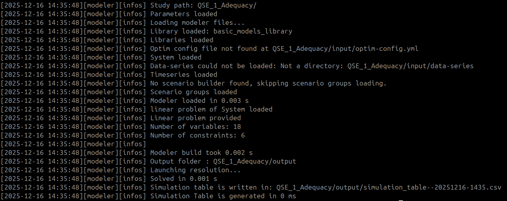

<div style="display: flex; justify-content: flex-end;">
  <a href="../../../..">
    
  </a>
</div>

# Antares Simulator's GEMS interpreter

This section outlines the approach for configuring and utilizing the **Antares Modeler**, the interpreter for the **GEMS language** inside [Antares Simulator](https://github.com/AntaresSimulatorTeam/Antares_Simulator).

## Installation

The following link provides access to the most recent stable version of the [Antares Simulator](https://github.com/AntaresSimulatorTeam/Antares_Simulator/releases).

### Download and Extract

1. Go to the [**Antares Simulator releases page**](https://github.com/AntaresSimulatorTeam/Antares_Simulator/releases)
2. Download the appropriate archive for your platform:
    - **Windows**: `rte-antares-<simulator-version>-installer-64bits.zip`
    - **Linux**: `rte-antares-<simulator-version>-Ubuntu-<ubuntu-version>tar.gz`
3. Extract the archive to your desired location:
    - **Windows**: Right-click and select "Extraction"
    - **Linux**: `tar -xzf rte-antares-<simulator-version>-Ubuntu-<ubuntu-version>tar.gz`

<div style="height: 500px; overflow: hidden;">
  
</div>

### Locate the Executables

After extraction, navigate to the `bin` folder inside the extracted directory. You will find:

- **Antares Modeler executable** (`antares-modeler` or `antares-modeler.exe`)
- **Antares Solver executable** (`antares-solver` or `antares-solver.exe`)

**Antares Modeler** is currently a command-line–only tool with no graphical interface yet. It is used for launching studies with full GEMS syntax.
**Antares Solver** is designed for running Antares legacy study and hybrid studies comprising a mix of legacy and Gems models.

<div style="overflow: hidden;">
  
</div>

### Launch the resolution of a GEMS study

**Opening a terminal:**

- **Windows**: Press `Win + R`, type `cmd` or `powershell`, and press Enter
- **Linux**: Press `Ctrl + Alt + T` or search for "Terminal" in your applications menu

#### Antares Modeler

**First study simulation with Modeler:**

Let’s check if Modeler is working correctly.

- **Download the example study:**

  Download the [first Quick Start Example (QSE_1_Adequacy)](https://github.com/AntaresSimulatorTeam/GEMS/tree/main/resources/Documentation_Examples/QSE/QSE_1_Adequacy) and save the "QSE_1_Adequacy" folder.

- **Run simulation:**

```bash
# On Windows:
.\bin\antares-modeler.exe .\<absolute path to QSE_1_Adequacy study folder>

# On Linux:
./bin/antares-modeler ./<absolute path to QSE_1_Adequacy study folder>
```

- **Check for success:**

  If you see logs like these, Modeler works correctly !

  Especially, `[yyyy-mm-dd HH:MM:SS][modeler][infos] Simulation table is written in: QSE_1_Adequacy/output/simulation_table--yyyymmdd HHMMSS.csv`

  

### Launch the resolution of an Hybrid study

#### Antares Solver

- Use the Hybrid Study tutorial :

  Refer to the tutorial inside the [Interoperability — Antares Hybrid Mode](../4_Interoperability/3_hybrid.md) section

- Run the following commands :
```bash
# Windows
rte-antares-x.x.x-installer-64bits\bin\antares-solver.exe <path-to-study>

# Linux
./rte-antares-x.x.x-installer-64bits/bin/antares-solver  <path-to-study>
```

Replace `<path-to-study>` with the path to your Antares study directory.

## Requirements

The complete installation, documentation is available on the [official documentation website](https://antares-simulator.readthedocs.io/en/latest/user-guide/02-install/).

In addition, Antares Modeler requires inside, the study folder, a `parameters.yml` file to run a GEMS study , and the process for creating this file is detailed in [this section](../3_User_Guide/3_GEMS_File_Structure/6_solver_optimization.md). Unlike the GemsPy interpreter, Modeler depends on this configuration file.

## Additional Resources

| Resource                | Link                                                                 |
|-------------------------|----------------------------------------------------------------------|
| Antares Simulator GitHub | [Antares Simulator on GitHub](https://github.com/AntaresSimulatorTeam/Antares_Simulator) |
| Online Documentation     | [Antares Simulator Docs](https://antares-simulator.readthedocs.io/en/latest/) |
| Modeler Documentation    | [GEMS Modeler Docs](https://antares-simulator.readthedocs.io/en/latest/user-guide/modeler/01-overview-modeler/) |
| Examples                 | See the repository's `examples/` directory                           |
| FAQ                      | [FAQ](../6_Support_Contributing/1_faq.md)                   |
| GitHub Issues            | [Antares Simulator Issues](https://github.com/AntaresSimulatorTeam/Antares_Simulator/issues) |
| Contact Support          | [Contact support](../6_Support_Contributing/2_contact.md)   |