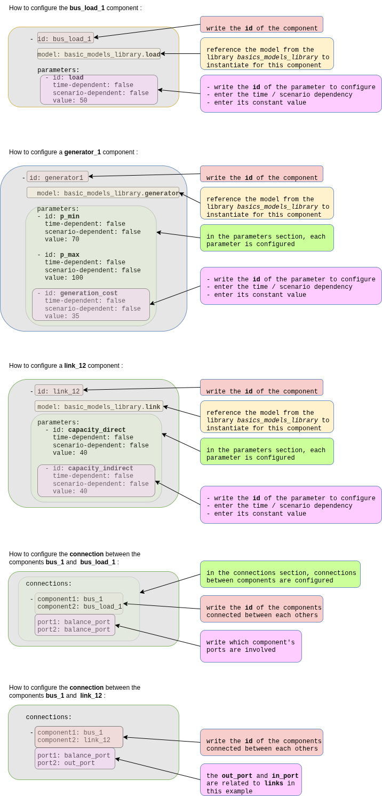

<div style="display: flex; justify-content: space-between; align-items: center;">
  <div style="text-align: left;">
    <a href="../../../..">Main Section</a>
  </div>
  <div style="text-align: right;">
    
  </div>
</div>


# Quick-start example 1: three-bus adequacy system

## Overview and problem description
This tutorial demonstrates resource adequacy modeling using a simplified three-bus meshed network over a single time-step. The example is intended solely to illustrate modeling concepts and should not be interpreted as a realistic system representation; however, it provides a foundation for developing more detailed and realistic models.

The study folder is on the [GEMS Github repository](https://github.com/AntaresSimulatorTeam/GEMS/tree/f5c772ab6cbfd7d6de9861478a1d70a25edf339d/doc/5_Examples/QSE/QSE_1_Adequacy).

### Adequacy definition

**Resource Adequacy** is the ability of the electric grid to satisfy the end-user power demand at all times. The main challenge is to get the balance between the electric **Production** (generator, storage) and **Consumption** (load, spillage) while respecting the **limitations of the grid**.


### Problem Description

**Time Horizon:** This example considers a single one-hour time step.

**Network Components:**

- 3 Buses (Regions 1, 2, 3 forming a triangle)
- 3 Links (connecting each pair of regions)
- 3 Generators (different capacities and costs)
- 3 Loads (fixed demands)

In this example, the `power flows` on the links are only constrained by thermal capacities.

**Generation:**

- Generator 1 (Bus 1): 70-100 MW capacity, 35 €/MWh cost
- Generator 2 (Bus 2): 50-90 MW capacity, 25 €/MWh cost
- Generator 3 (Bus 3): 50-200 MW capacity, 42 €/MWh cost

**Demand:**

- Bus 1: 50 MW
- Bus 2: 40 MW
- Bus 3: 150 MW
- **Total Load: 240 MW**

**Transmission Capacities:**

- Link 1-2: 40 MW (bidirectional)
- Link 2-3: 30 MW (bidirectional)
- Link 3-1: 50 MW (bidirectional)

**Economic Parameters:**

- Spillage cost: 1000 €/MWh (penalty for wasted energy)
- Unsupplied energy cost: 10000 €/MWh (high penalty for unmet demand)

**Network Topology:**


## The GEMS study

### Files Structure

Following block represents GEMS Framework study folder structure.
```
QSE_1_adequacy/
├── input/
│   ├──model-libraries/
│   │  ├── basic_models_library.yml
│   │  └── ...
│   ├── system.yml
│   └── data-series/
│       └──  ...
└── parameters.yml
```
The example study makes use of models provided by the [GEMS library](https://github.com/AntaresSimulatorTeam/GEMS/tree/f5c772ab6cbfd7d6de9861478a1d70a25edf339d/libraries). For maintainability reasons, the library is stored separately in the repository and is not included directly in the example study. Consequently, users must copy the [`basic_models_library.yml`](https://github.com/AntaresSimulatorTeam/GEMS/blob/f5c772ab6cbfd7d6de9861478a1d70a25edf339d/libraries/basic_models_library.yml) file into the example study directory (`QSE_1_adequacy/input/model-libraries/`) prior to execution.

Since this example performs the simulation over a single time step, the data-series folder does not contain any time-series data.

Simulation options can be configured in the `parameters.yml` file. For more details on available simulation options, refer to the following [link](https://github.com/AntaresSimulatorTeam/Antares_Simulator/blob/develop/docs/user-guide/modeler/04-parameters.md).

### Models Library

System of the **Three-bus Adequacy** example rely on models defined in the GEMS library file [`basic_models_library.yml`](https://github.com/AntaresSimulatorTeam/GEMS/blob/f5c772ab6cbfd7d6de9861478a1d70a25edf339d/libraries/basic_models_library.yml). These models encode the decision variables, objective-function contributions, and constraints that collectively form the optimization problem.

The complete mathematical formulation corresponding to this example — including decision variables, parameters, objective function, and constraints — is detailed in the following document:

[**Mathematical representation of the Three-bus Adequacy problem**](3_QSE_adequacy_math_model.md)

### System file and Optimization Graph

Following diagrams represents part of the `system.yml` where user is able to instantiate components (buses, links, generators etc.) and connect them via ports into the optimization graph.

Instantiation of components `bus_1`, `bus_load_1`, `generator_1` and `link_12` is represented as well as connection between `bus_1` and `bus_load_1` components and connection between `bus_1` and `link_12` components. Entire system file can be found [in this repo](https://github.com/AntaresSimulatorTeam/GEMS/blob/15b4821113a09a417b73d00b3bc24f819ef44c99/doc/5_Examples/QSE/QSE_1_Adequacy/input/system.yml).



Based on the connection via components from `connections` section in `system.yml` file, optimization graph can be build. Following graph represents optimization graph of **Three-bus Adequacy example**.


## Running the GEMS study with Antares Modeler

1. Get Antares Modeler installed through this [tutorial](../1_installation)
2. Go to the Parent folder of `rte-antares-9.3.2-installer-64bits/`
3. Open the terminal
4. Run these command lines :

```bash
# Windows
rte-antares-9.3.2-installer-64bits\bin\antares-modeler.exe <path-to-study>

# Linux
./antares-9.3.2-Ubuntu-22.04/bin/antares-modeler <path-to-study>
```

## Outputs

The results are available in the folder:
- `QSE_1_Adequacy/output/simulation_table--YYYYMMDD-HHMM.csv`

The simulation outputs contain the optimized value of optimization problem variables, the status of all contraints and bounds, as well as user defined extra output, as described on the following [page](../3_User_Guide/4_outputs.md).

The power flows between buses can be visualized as follows:


By utilizing the extra output feature, the marginal price is obtained as the dual value of the power balance constraint at each bus:

- `bus_1` : **35 €**, as `bus_1` consumes its own power produced at 35 €/MW
- `bus_2` : **35 €**, as `generator_2` is at its maximum rate, so the next produced 1MWh will be generated by `bus_1` and the power will be transferred by `link12`. Therefore, the marginal price for `bus_2` is 35€/MW.
- `bus_3` : **42 €**, because `bus_3` produces its own power produced at 42 €/MW


The following graphs show the merit order of the generator and links flows :

<div style="display: flex; justify-content: center; gap: 32px; align-items: flex-start;">
  <figure style="width:45%; margin:0;">
    
    <figcaption style="text-align:center; margin-top:8px;">
      This graph shows the power output of each generator in the system, illustrating how the optimizer allocates generation based on cost and capacity constraints.
    </figcaption>
  </figure>
  <figure style="width:45%; margin:0;">
    
    <figcaption style="text-align:center; margin-top:8px;">
      Above the blue absciss axis, the flow represents import, below it's export.
    </figcaption>
  </figure>
</div>

---
**Navigation**
<div style="display: flex; justify-content: space-between;">
  <div style="text-align: left;">
  <button type="button" style="background-color:#CCCCCC; border:none; padding:8px 16px; border-radius:4px; cursor:pointer">
    <a href="../1_installation" style="text-decoration:none; color: #000000">⬅️ Previous page</a>
  </button>
  </div>
  <button type="button" style="background-color:#AAAAFF; border:none; padding:8px 16px; border-radius:4px; cursor:pointer">
    <a href="../../../.." style="text-decoration:none; color: #FFFFFF">Index</a>
  </button>
  <div style="text-align: right;">
  <button type="button" style="background-color:#CCCCCC; border:none; padding:8px 16px; border-radius:4px; cursor:pointer">
    <a href="../3_QSE_Unit_Commitment" style="text-decoration:none; color: #000000">Next page ➡️</a>
  </button>
  </div>
</div>

---

© GEMS (LICENSE) 