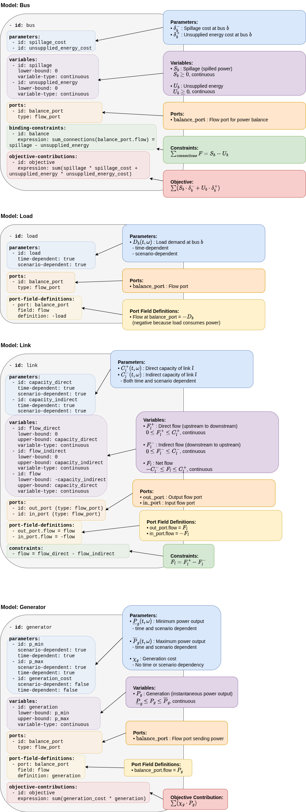

  

    <a href="../../../..">Main Section</a>
  

  

    
  

# Mathematical representation

This part represents the optimization problem formulation of the example [QSE_Adequacy ](2A_QSE_adequacy.md) that is built up from [`basic-models_library.yml`](https://github.com/AntaresSimulatorTeam/GEMS/blob/main/libraries/basic_models_library.yml) library. The referenced library includes additional models that are not used in the example and are therefore not included in the optimization problem formulation.

## Glossary of Mathematical Symbols

### General notation

| Symbol | Description |
|--------|-------------|
| $L$ | Set of transmission links (edges of the power system graph) |
| $B$ | Set of buses, ordered set |
| $G_b$ | Set of generators installed at bus $b$ |
| $L_b^+$ | Set of links for which $b$ is the upstream vertex |
| $L_b^-$ | Set of links for which $b$ is the downstream vertex |

### Decision Variables

| Symbol | Description | Unit |
|--------|-------------|------|
| $F_l$ | Net power flow through link $l$ | MW |
| $F_l^+$ | Power flow through link $l$, from upstream to downstream | MW |
| $F_l^-$ | Power flow through link $l$, from downstream to upstream | MW |
| $P_g$ | Power output from generator $g$ | MW |
| $U_b$ | Unsupplied power at bus $b$ (in nominal state) | MW |
| $S_b$ | Spilled power at bus $b$ (in nominal state) | MW |

### Parameters

| Symbol | Description | Unit |
|--------|-------------|------|
| $\overline{C_l^+}$ | Maximum transmission capacity (upstream to downstream) | MW |
| $\overline{C_l^-}$ | Maximum transmission capacity (downstream to upstream) | MW |
| $\underline{P}_g$ | Minimum power output from generator $g$ | MW |
| $\overline{P}_g$ | Maximum power output from generator $g$ | MW |
| $\chi_g$ | Output cost from generator $g$ | €/MWh |
| $\delta_b^+$ | Normative unsupplied energy cost at bus $b$ (value of lost load) | €/MWh |
| $\delta_b^-$ | Normative spilled energy cost at bus $b$ (value of wasted energy) | €/MWh |
| $D_b$ | Net power demand at bus $b$ | MW |

## Optimization Problem

The objective function to minimize the total dispatch cost for the three-bus system is:

$$
\min(\Omega_{\text{dispatch}})
$$

where $\Omega_{\text{dispatch}}$ is composed of the following cost components:

$$
\Omega_{\text{dispatch}} = \Omega_{\text{generator}} + \Omega_{\text{unsupplied}} + \Omega_{\text{spillage}}
$$

## Objective function for each component

### Thermal Generation Cost

For the generators in the system:

$$
\Omega_{\text{generator}} = \sum_{b \in B} \sum_{g \in G_b}   \chi_{g} \cdot P_{g} 
$$

### Unsupplied Energy Cost

For the three buses in the system:

$$
\Omega_{\text{unsupplied}} = \sum_{b \in B} \delta_{b}^+ \cdot U_{b} 
$$

where $U_b$ represents unsupplied energy at bus $b$.

### Spillage Cost

For the three buses in the system:

$$
\Omega_{\text{spillage}} = \sum_{b \in B} \delta_{b}^- \cdot S_{b} 
$$

where $S_b$ represents spilled energy at bus $b$.

## Balance Constraints

### First Kirchhoff's Law (Power Balance):

$$
\forall b \in B, \sum_{g \in G_b} P_g - D_b + \sum_{l \in L_b^+} F_l - \sum_{l \in L_b^-} F_l = S_b - U_b
$$

## Flow Capacity Constraints

### Flow Definition Constraint:

$$
\forall l \in L, \quad F_l = F_l^+ - F_l^-
$$

## Thermal Units

### Power Output Constraints

Power output is bounded by must-run commitments and power availability:

$$
\forall b \in B, \forall g \in G_b, \quad \underline{P}_g \leq P_g \leq \overline{P}_g
$$

# GEMS Representation and Library File

This section shows how mathematical model is implemented for every power system element that figures in optimization problem. File in which models are defined is called *library file*, in this case [`basic_models_library.yml`](https://github.com/AntaresSimulatorTeam/GEMS/blob/main/libraries/basic_models_library.yml) library.

# Summary
This mathematical description serves as the formal reference for the optimization problem, while the GEMS library provides its implementation layer within the GEMS framework. In other words:

- the **mathematical model** defines what problem is being solved

- the **GEMS library** defines how this problem is represented and can be assembled in the optimization graph

Together, the [library models](#library-file) and the [system configuration](2A_QSE_adequacy.md/#system-file-and-optimization-graph), with input data, fully reproduce the optimization problem described in the [mathematical formulation](#mathematical-representation).

Note that this example is configured with a single time step. As a result, parameter attributes related to time and scenario dependency are overridden in the system configuration.

---
**Navigation**

  

  <button type="button" style="background-color:#CCCCCC; border:none; padding:8px 16px; border-radius:4px; cursor:pointer">
    <a href="../1A_gemspy_installation" style="text-decoration:none; color: #000000">⬅️ Previous page</a>
  </button>
  

  <button type="button" style="background-color:#AAAAFF; border:none; padding:8px 16px; border-radius:4px; cursor:pointer">
    <a href="../../../.." style="text-decoration:none; color: #FFFFFF">Index</a>
  </button>
  

  <button type="button" style="background-color:#CCCCCC; border:none; padding:8px 16px; border-radius:4px; cursor:pointer">
    <a href="../2B_QSE_Unit_Commitment" style="text-decoration:none; color: #000000">Next page ➡️</a>
  </button>
  

---

© GEMS (LICENSE) 