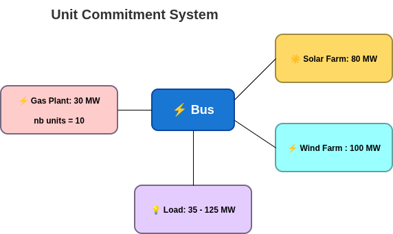

<div style="display: flex; justify-content: space-between; align-items: center;">
  <div style="text-align: left;">
    <a href="../../../..">Main Section</a>
  </div>
  <div style="text-align: right;">
    
  </div>
</div>

# QSE 2: Economic Dispatch - Week-Long Optimization

## Overview
This tutorial demonstrates economic dispatch optimization over a one-week time horizon. Economic dispatch determines the optimal power output from each generator at each time period to meet demand at minimum cost.

The study folder is on the [GEMS Github repository](https://github.com/AntaresSimulatorTeam/GEMS/tree/main/doc/5_Examples/QSE/QSE_2_Unit_Commitment).

**Definition :** 

**Economic Dispatch** is the problem of determining the optimal power output from generation units over a 7 days horizon.

## Files Structure

```
QSE_2_Unit_Commitment/
├── input/
│   ├── system.yml
│   ├── model-libraries/
│   │   └── unit_commitment_library.yml
│   └── data-series/
│       ├── load_bus_A.csv
│       ├── load_bus_B.csv
│       ├── wind_generation.csv
│       └── solar_generation.csv
└── parameters.yml
```

## Problem Description

**Components:**

  - 2 Buses (Region A and Region B)
  - 1 Link (connecting the two regions)
  - 4 Thermal Generators (with capacity and cost constraints)
  - 2 Renewable Generators (wind and solar with variable profiles)
  - 2 Loads (variable demand over the week)

**Time Horizon:** 168 hours (1 week) with hourly resolution



# Mathematical Representation

This section presents the mathematical formulation of the economic dispatch problem. The notation is adapted from the [Antares Simulator Wiki](https://xwiki.antares-simulator.org/xwiki/bin/view/Reference%20guide/4.%20Active%20windows/5.Optimization%20problem/).

## Glossary of Mathematical Symbols

### General notation

| Symbol | Description |
|--------|-------------|
| $T$ | Set of time periods (hours), $t \in \{1, 2, ..., 168\}$ |
| $B$ | Set of buses (regions) |
| $G_b$ | Set of thermal generators at bus $b$ |
| $R_b$ | Set of renewable generators at bus $b$ |
| $L$ | Set of transmission links |

### Decision Variables

| Symbol | Description | Unit |
|--------|-------------|------|
| $P_{g,t}$ | Power output from generator $g$ at time $t$ | MW |
| $F_{l,t}$ | Net power flow through link $l$ at time $t$ | MW |
| $U_{b,t}$ | Unsupplied power at bus $b$ at time $t$ | MW |
| $S_{b,t}$ | Spilled power at bus $b$ at time $t$ | MW |

### Parameters - Generator Technical Constraints

| Symbol | Description | Unit |
|--------|-------------|------|
| $\underline{P}_g$ | Minimum power output | MW |
| $\overline{P}_g$ | Maximum power output | MW |
| $\epsilon_g$ | CO2 emission factor | tCO2/MWh |

### Parameters - Economic

| Symbol | Description | Unit |
|--------|-------------|------|
| $\chi_g$ | Variable generation cost | \$/MWh |
| $\delta_b^+$ | Unsupplied energy cost (value of lost load) | \$/MWh |
| $\delta_b^-$ | Spillage cost | \$/MWh |

### Parameters - System

| Symbol | Description | Unit |
|--------|-------------|------|
| $D_{b,t}$ | Load demand at bus $b$ at time $t$ | MW |
| $\overline{W}_{r,t}$ | Available renewable generation from source $r$ at time $t$ | MW |
| $\overline{F}_l$ | Transmission capacity of link $l$ | MW |

## Optimization Problem

The objective function minimizes total system cost over the week:

$$
\min(\Omega_{\text{total}})
$$

where:

$$
\Omega_{\text{total}} = \Omega_{\text{generation}} + \Omega_{\text{unsupplied}} + \Omega_{\text{spillage}}
$$

## Objective Function Components

### Generation Cost

Variable cost of running generators:

$$
\Omega_{\text{generation}} = \sum_{t \in T} \sum_{b \in B} \sum_{g \in G_b} \chi_g \cdot P_{g,t}
$$

### Unsupplied Energy Cost

Penalty for not meeting demand:

$$
\Omega_{\text{unsupplied}} = \sum_{t \in T} \sum_{b \in B} \delta_b^+ \cdot U_{b,t}
$$

### Spillage Cost

Penalty for wasted renewable energy:

$$
\Omega_{\text{spillage}} = \sum_{t \in T} \sum_{b \in B} \delta_b^- \cdot S_{b,t}
$$

## Constraints

### First Kirchhoff's Law (Power Balance)

For each bus and time period:

$$
\forall b \in B, \forall t \in T: \quad \sum_{g \in G_b} P_{g,t} + \sum_{r \in R_b} \overline{W}_{r,t} - D_{b,t} + \sum_{l \in L_b^+} F_{l,t} - \sum_{l \in L_b^-} F_{l,t} = S_{b,t} - U_{b,t}
$$

### Generator Output Limits

Power output must respect capacity bounds:

$$
\forall g \in G, \forall t \in T: \quad \underline{P}_g \leq P_{g,t} \leq \overline{P}_g
$$

# YAML Block Description

## Library File

The library file defines the models for buses, loads, generators, renewables, and transmission links.


## System File

### System Configuration

- Create `system.yml` with the following characteristics:

**Region A:**
- Coal plant: 200 MW max, 80 MW min, $35/MWh, CO2 factor 0.9
- Gas plant: 150 MW max, 30 MW min, $50/MWh, CO2 factor 0.4
- Wind farm: Variable generation from timeseries
- Load: Variable demand from timeseries

**Region B:**
- Nuclear plant: 300 MW max, 200 MW min, $15/MWh, CO2 factor 0
- Gas plant: 100 MW max, 10 MW min, $80/MWh, CO2 factor 0.5
- Solar farm: Variable generation from timeseries
- Load: Variable demand from timeseries

**Transmission:**
- Link A-B: 100 MW bidirectional capacity

### How to write the system YAML file


# Time Series Data

## Load Profiles

Weekly load profiles with typical daily patterns for both regions. Each load has its own CSV file.

Here the profile of load for bus_A :


## Renewable Generation Profiles

Here the profile of solar generation :


# How to Run the Study

## By Using Modeler

1. Get Modeler installed through this [tutorial](./1_installation.md)
2. Go to the Parent folder of `rte-antares-9.3.2-installer-64bits/`
3. Open the terminal
4. Run these command lines :

```bash
# Windows
rte-antares-9.3.2-installer-64bits\bin\antares-9.3-modeler.exe <path-to-study>

# Linux
./rte-antares-9.3.2-installer-64bits/bin/antares-9.3-modeler <path-to-study>
```

The results will be available in the folder `<study_folder>/output`

## Outputs

In `output` folder, the simulation table csv file represents the results of the simulation.

The following graphs show the merit order of the generator and links flows :

<div style="display: flex; justify-content: center; gap: 32px; align-items: flex-start;">
  
  
</div>

---

**Navigation**
<div style="display: flex; justify-content: space-between;">
  <div style="text-align: left;">
  <button type="button" style="background-color:#CCCCCC; border:none; padding:8px 16px; border-radius:4px; cursor:pointer">
    <a href="../2A_QSE_adequacy" style="text-decoration:none; color: #000000">⬅️ Previous: Adequacy</a>
  </button>
  </div>
  <button type="button" style="background-color:#AAAAFF; border:none; padding:8px 16px; border-radius:4px; cursor:pointer">
    <a href="../../../.." style="text-decoration:none; color: #FFFFFF">Index</a>
  </button>
  <div style="text-align: right;">
  <button type="button" style="background-color:#CCCCCC; border:none; padding:8px 16px; border-radius:4px; cursor:pointer">
    <a href="../4_QSE_Investment" style="text-decoration:none; color: #000000">Next: Investment ➡️</a>
  </button>
  </div>
</div>

---

© GEMS (LICENSE)
