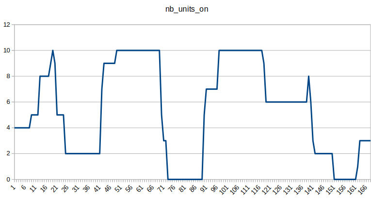

<div style="display: flex; justify-content: space-between; align-items: center;">
  <div style="text-align: left;">
    <a href="../../../..">Main Section</a>
  </div>
  <div style="text-align: right;">
    
  </div>
</div>

# QSE 2: Unit Commitment - Simple Example

## Overview
This tutorial demonstrates a simple unit commitment optimization. Unit commitment determines the optimal number of units generating power from one single generator at each time period to meet demand at minimum cost.

The study folder is on the [GEMS Github repository](https://github.com/AntaresSimulatorTeam/GEMS/tree/main/doc/5_Examples/QSE/QSE_2_Unit_Commitment).

## Files Structure

```
QSE_2_Unit_Commitment/
├── input/
│   ├── system.yml
│   ├── model-libraries/
│   │   └── unit_commitment_library.yml
│   └── data-series/
│       ├── load.csv
│       ├── solar.csv
│       └── wind.csv
└── parameters.yml
```

## Problem Description

**Components:**

  - 1 Bus (central node for power balance)
  - 1 Thermal cluster (10 units of 3 MW each, 30 MW total capacity)
  - 1 Solar Plant
  - 1 Wind Plant
  - 1 Load (variable demand, 35-125 MW)

**Time Horizon:** 1 week with hourly resolution (168 hours)


# Mathematical Representation

This section presents the mathematical formulation of the unit commitment problem.

## Glossary of Mathematical Symbols

### General notation

| Symbol | Description |
|--------|-------------|
| $T$ | Set of time periods (hours), $t \in \{1, 2, ..., 168\}$ |
| $b$ | The single bus in the system |
| $N$ | Number of thermal units (10) |

### Decision Variables - Thermal

| Symbol | Description | Unit | Type |
|--------|-------------|------|------|
| $P_{t}$ | Total power output from thermal cluster at time $t$ | MW | Continuous |
| $n^{on}_{t}$ | Number of units ON at time $t$ | - | Integer |
| $n^{start}_{t}$ | Number of units starting at time $t$ | - | Integer |
| $n^{stop}_{t}$ | Number of units stopping at time $t$ | - | Integer |

### Decision Variables - System

| Symbol | Description | Unit |
|--------|-------------|------|
| $U_{t}$ | Unsupplied power at time $t$ | MW |
| $S_{t}$ | Spilled power at time $t$ | MW |

### Parameters - Thermal

| Symbol | Description | Value | Unit |
|--------|-------------|-------|------|
| $\underline{P}^{unit}$ | Minimum power per unit | 0 | MW |
| $\overline{P}^{unit}$ | Maximum power per unit | 1 | MW |
| $\chi^{gen}$ | Variable generation cost | 50 | $/MWh |
| $\chi^{start}$ | Startup cost | 100 | $ |
| $\chi^{fix}$ | Fixed cost (per unit ON) | 10 | $/h |
| $\tau^{up}$ | Minimum up time | 2 | hours |
| $\tau^{down}$ | Minimum down time | 2 | hours |

### Parameters - Renewables

| Symbol | Description | Unit |
|--------|-------------|------|
| $R^{solar}_{t}$ | Solar generation at time $t$ | MW |
| $R^{wind}_{t}$ | Wind generation at time $t$ | MW |

### Parameters - System

| Symbol | Description | Value | Unit |
|--------|-------------|-------|------|
| $D_{t}$ | Load demand at time $t$ | 35-125 | MW |
| $\delta^+$ | Unsupplied energy cost | 10000 | $/MWh |
| $\delta^-$ | Spillage cost | 1000 | $/MWh |

## Optimization Problem

The objective function minimizes total system cost:

$$
\min(\Omega_{\text{total}})
$$

where:

$$
\Omega_{\text{total}} = \Omega_{\text{thermal}} + \Omega_{\text{unsupplied}} + \Omega_{\text{spillage}}
$$

## Objective Function Components

### Thermal Generation Cost

$$
\Omega_{\text{thermal}} = \sum_{t \in T} \left( \chi^{gen} \cdot P_{t} + \chi^{start} \cdot n^{start}_{t} + \chi^{fix} \cdot n^{on}_{t} \right)
$$

### Unsupplied Energy Cost

$$
\Omega_{\text{unsupplied}} = \sum_{t \in T} \delta^+ \cdot U_{t}
$$

### Spillage Cost

$$
\Omega_{\text{spillage}} = \sum_{t \in T} \delta^- \cdot S_{t}
$$

## Constraints

### Power Balance (Kirchhoff's Law)

For each time period, generation must equal demand plus spillage minus unsupplied:

$$
\forall t \in T: \quad P_{t} + R^{solar}_{t} + R^{wind}_{t} - D_{t} = S_{t} - U_{t}
$$

### Thermal Generation Limits

The thermal output is bounded by the number of units ON:

$$
\forall t \in T: \quad n^{on}_{t} \cdot \underline{P}^{unit} \leq P_{t} \leq n^{on}_{t} \cdot \overline{P}^{unit}
$$

### Unit Dynamics

The number of units ON follows the commitment dynamics:

$$
\forall t \in T: \quad n^{on}_{t} = n^{on}_{t-1} + n^{start}_{t} - n^{stop}_{t}
$$

### Minimum Up Time

Once started, a unit must stay ON for at least $\tau^{up}$ hours:

$$
\forall t \in T: \quad \sum_{\tau = t - \tau^{up} + 1}^{t} n^{start}_{\tau} \leq n^{on}_{t}
$$

### Minimum Down Time

Once stopped, a unit must stay OFF for at least $\tau^{down}$ hours:

$$
\forall t \in T: \quad \sum_{\tau = t - \tau^{down} + 1}^{t} n^{stop}_{\tau} \leq N - n^{on}_{t}
$$

# YAML Block Description

## Library File

The library file `antares_legacy_models.yml` defines four models:

- **bus**: Central node with power balance constraint, spillage and unsupplied energy variables
- **load**: Consumes power (negative flow into the bus)
- **thermal**: Dispatchable thermal cluster with unit commitment logic (integer variables for units ON/starting/stopping)
- **renewable**: Non-dispatchable generation for solar and wind plants

## System File

### System Configuration

The `system.yml` file defines:

**Bus:**
- `spillage_cost` = 1000 $/MWh
- `unsupplied_energy_cost` = 10000 $/MWh

**Thermal Cluster (10 units of 1 MW):**
- All thermal parameters (min/max power, costs, min up/down, number of units) are set directly in `system.yml`.

**Renewables:**
- Solar: generation from `solar.csv` timeseries
- Wind: generation from `wind.csv` timeseries

<div style="display: flex; gap: 24px; align-items: flex-start;">
  <div>
    
  </div>
  <div>
    
  </div>
</div>

**Load:**
- Variable demand from `load.csv` timeseries 


# Understanding the Results

## Output Variables

The simulation outputs are saved in `output/simulation_table--<timestamp>.csv`. Key variables include:

## Thermal Unit Commitment Variables

| Variable | Description |
|----------|-------------|
| `thermal,nb_units_on` | **Number of units currently ON** (0-10). This is the key output showing how many thermal units are committed at each hour. |
| `thermal,nb_starting` | Number of units starting up at this hour |
| `thermal,nb_stopping` | Number of units shutting down at this hour |
| `thermal,generation` | Total power output from the thermal cluster (MW) |



# How to Run the Study

## By Using Modeler

1. Get Modeler installed through this [tutorial](../1_installation)
2. Go to the Parent folder of `rte-antares-9.3.2-installer-64bits/`
3. Open the terminal
4. Run these command lines :

```bash
# Windows
rte-antares-9.3.2-installer-64bits\bin\antares-9.3-modeler.exe <path-to-study>

# Linux
./rte-antares-9.3.2-installer-64bits/bin/antares-9.3-modeler <path-to-study>
```

The results will be available in the folder `<study_folder>/output`

---

**Navigation**
<div style="display: flex; justify-content: space-between;">
  <div style="text-align: left;">
  <button type="button" style="background-color:#CCCCCC; border:none; padding:8px 16px; border-radius:4px; cursor:pointer">
    <a href="../2A_QSE_adequacy" style="text-decoration:none; color: #000000">⬅️ Previous: Adequacy</a>
  </button>
  </div>
  <button type="button" style="background-color:#AAAAFF; border:none; padding:8px 16px; border-radius:4px; cursor:pointer">
    <a href="../../../.." style="text-decoration:none; color: #FFFFFF">Index</a>
  </button>
  <div style="text-align: right;">
  <button type="button" style="background-color:#CCCCCC; border:none; padding:8px 16px; border-radius:4px; cursor:pointer">
    <a href="../4_QSE_Investment" style="text-decoration:none; color: #000000">Next: Investment ➡️</a>
  </button>
  </div>
</div>

---

© GEMS (LICENSE)
