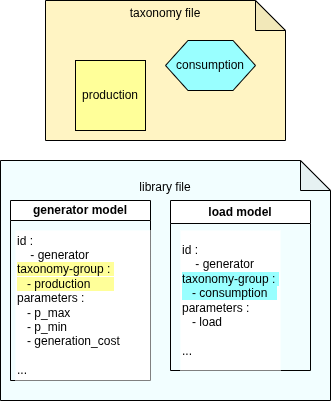

<div style="display: flex; justify-content: space-between; align-items: center;">
  <div style="text-align: left;">
    <a href="../../../..">Main Section</a>
  </div>
  <div style="text-align: right;">
    
  </div>
</div>

*This section coms from Overview.concepts file*

# Model definition (from system.yml)

<<<<<<<< HEAD:doc/3_User_Guide/2_mathematical_syntax.md
Model and its configuration is defined in [Overview section](../1_Overview/Concepts/1_core_concepts)

# Components specification (from system.yml)

Components and its configuration is defined in [Overview section](../1_Overview/Concepts/1_core_concepts)
========
Model and its configuration is defined in [Overview section](../1_Overview/Concepts/1_core_concepts.md)

# Components specification (from system.yml)

Components and its configuration is defined in [Overview section](../1_Overview/Concepts/1_core_concepts.md)
>>>>>>>> main:doc/3_User_Guide/1_syntax.md

# Dataseries
Currently, the framework supports defining **dataseries** using tab-seperated-values files. Values must be separated using tabs, and the character `.` represents the floating point.

## Scenario / Time Dependency
Inside the YAML files, **Parameters, Variables, and Constraints** can be dependent on the scenario and/or over time.
- A **scenario dependency** means, for instance, that the *parameter* `fixed_cost` for starting up a plant can depend on the chosen scenario.

    A simulation with 4 scenarios will get :
    `54 67.5 23.652 253`
- A **time dependent** *parameter* can be for instance `max_active_power_set_point` dependending on plant maintenancy. A time dependency needs a dataserie for getting data

    A simulation with 4 timestamps will get :
    ```
    54 
    67.5 
    23.652 
    253```

# Outputs

## Taxonomy 



The outputs of GEMS contain the results of the modelisation, in a LP format (**Optimization Problem**) and for hybrid and pure modeler studies in CSV format (**simulation table**), there are also **extra-outputs**. Their structure is detailed inside UserGuide section.

- **Optimization Problem**
    The optimization model solved by Antares modeler is written in the human-readable LP format, under output/problem.lp. It is only meant to be used for debugging.

- **Simulation Table**
    Antares Simulator (hybrid and modeler modes) produces detailed optimization results for the modeler's components, in the "simulation table", in CSV format

    - **Extra Outputs**
        Extra-Outputs computed after optimization (using optimal variable values). These appear in the output files alongside variable and port values inside the simulation table.

- **Business Views**
    Output files with metrics specifically designed for users purposes. It made from the simulation table.

---
**Navigation**
<div style="display: flex; justify-content: space-between;">
  <div style="text-align: left;">
  <button type="button" style="background-color:#CCCCCC; border:none; padding:8px 16px; border-radius:4px; cursor:pointer">
    <a href="previous.md" style="text-decoration:none; color: #000000">⬅️ Previous page</a>
  </button>
  </div>
  <button type="button" style="background-color:#AAAAFF; border:none; padding:8px 16px; border-radius:4px; cursor:pointer">
    <a href="Home/Main_Home/1_context_GEMS.md" style="text-decoration:none; color: #FFFFFF">Index</a>
  </button>
  <div style="text-align: right;">
  <button type="button" style="background-color:#CCCCCC; border:none; padding:8px 16px; border-radius:4px; cursor:pointer">
    <a href="next.md" style="text-decoration:none; color: #000000">Next page ➡️</a>
  </button>
  </div>
</div>

---

© GEMS (LICENSE)