  

    <a href="../../../..">Main Section</a>
  

  

    
  

# File Structure

This section provides a high-level overview of the specific files used by [**GEMS framework**](../../../..) and how they collectively describe a complete GEMS study.

These files describe the models logic, input data, scenarios, solver settings, and output representations. A summary of the expected files and their roles is provided in the [GEMS Architecture](../../../1_Overview/Concepts/2_architecture).

Understanding how these files fit together is essential for building, modifying, maintaining and analyzing GEMS studies.

The diagram below illustrates the typical organisation of a GEMS study:

```mermaid
flowchart LR
    Study["📁 QSE_1_adequacy/"]
    Input["📁 input/"]
    ModelLib["📁 model-libraries/"]
    DataSeries["📁 data-series/"]
    
    System["📄 system.yml"]
    Params["📄 parameters.yml"]
    Lib1["📄 library_1.yml"]
    Lib2["📄 library_2.yml"]
    Data1["📊 data-series_1.csv"]
    Data2["📊 data-series_2.csv"]
    
    Study --> Input
    Study --> Params
    Input --> ModelLib
    Input --> System
    Input --> DataSeries
    ModelLib --> Lib1
    ModelLib --> Lib2
    DataSeries --> Data1
    DataSeries --> Data2
    
    style Study fill:#fff3cd,stroke:#ffc107,stroke-width:3px
    style Input fill:#d1ecf1,stroke:#0dcaf0,stroke-width:2px
    style ModelLib fill:#d1ecf1,stroke:#0dcaf0,stroke-width:2px
    style DataSeries fill:#d1ecf1,stroke:#0dcaf0,stroke-width:2px
    style System fill:#d4edda,stroke:#28a745,stroke-width:3px
    style Params fill:#d4edda,stroke:#28a745,stroke-width:3px
    style Lib1 fill:#d4edda,stroke:#28a745,stroke-width:3px
    style Lib2 fill:#e1f5ff,stroke:#0288d1,stroke-width:2px
    style Data1 fill:#e1f5ff,stroke:#0288d1,stroke-width:2px
    style Data2 fill:#e1f5ff,stroke:#0288d1,stroke-width:2px
    
    click Lib1 "https://github.com/AntaresSimulatorTeam/GEMS/blob/main/libraries/basic_models_library.yml" "Example: basic_models_library"
    click System "https://github.com/AntaresSimulatorTeam/GEMS/blob/documentation/get_started_quick_examples/resources/Documentation_Examples/QSE/QSE_1_Adequacy/input/system.yml" "Example: system file from Quick Start Example 1"
    click Params "https://github.com/AntaresSimulatorTeam/GEMS/blob/documentation/get_started_quick_examples/resources/Documentation_Examples/QSE/QSE_1_Adequacy/parameters.yml" "Example: parameters file"
```

The following pages of this section describe each file and folder in detail. Each page focuses on the role of a specific file, its expected structure, and how it interacts with the rest of the file to form a consistent and executable GEMS study.

**Navigation**

  

  <button type="button" style="background-color:#CCCCCC; border:none; padding:8px 16px; border-radius:4px; cursor:pointer">
    <a href="../../1_Overview/References/4_Users" style="text-decoration:none; color: #000000">⬅️ Previous page</a>
  </button>
  

  <button type="button" style="background-color:#AAAAFF; border:none; padding:8px 16px; border-radius:4px; cursor:pointer">
    <a href="../../../.." style="text-decoration:none; color: #FFFFFF">Index</a>
  </button>
  

  <button type="button" style="background-color:#CCCCCC; border:none; padding:8px 16px; border-radius:4px; cursor:pointer">
    <a href="../1B_gemspy_installation" style="text-decoration:none; color: #000000">Next page ➡️</a>
  </button>
  

---

© GEMS (LICENSE)