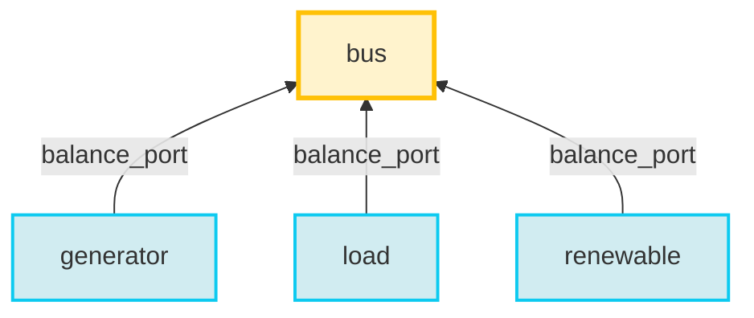

<div style="display: flex; justify-content: space-between; align-items: center;">
  <div style="text-align: left;">
    <a href="../../../..">Main Section</a>
  </div>
  <div style="text-align: right;">
    
  </div>
</div>

# The Hypergraph of a GEMS sysetm
## 1 GEMS system = 1 hypergraph

[GEMS](../../index.md) represents a system as a **[hypergraph](https://en.wikipedia.org/wiki/Hypergraph)**.  This is precisely the content of a [system](../3_GEMS_File_Structure/3_system.md) file.


- [Vertices](https://en.wikipedia.org/wiki/Vertex_(graph_theory)) correspond to **[components](../3_GEMS_File_Structure/3_system.md#components)**, 
- [Hyperedges ](https://en.wikipedia.org/wiki/Glossary_of_graph_theory#hyperedge) corresponds to **[connections](../3_GEMS_File_Structure/3_system.md#connections)**, which are characterized by **ports**.


This abstraction enables [GEMS](../../index.md) users to represent information exchanges between components. A connection allows a component to share (Linear) Expressions with others.

In this structure, **components** play either an **emitter** or **receiver**
role, while ports remain neutral connection interfaces.

## Emitter and Receiver Roles

A **component** is an instance of a model and represents a system element
(e.g. generator, load, storage, bus).

Depending how [port](../3_GEMS_File_Structure/2_library.md#ports) is defined inside the model it refers to, a component can act as:

### Role definition rule

- **Emitter**: If a model defines `port-field-definitions` for a given port, the component acts as an **emitter** for that port. The expression specified in the `definition` field is **emitted** through the port and made available to connected components.

- If a model defines a port **without** any `port-field-definitions`, the component acts as a **receiver** for that port. In this case, the component does not emit any expression and instead **aggregates expressions** emitted by connected components to define its behavior. The receiver uses these aggregated expressions to define one or more `binding-constraints` in its model.

The emitter/receiver role is therefore a **model-level property**, inferred from the model definition, and not an attribute of the port itself.

#### Example of receiver model

```yaml
- id: bus
      parameters:
        - id: spillage_cost
        - id: unsupplied_energy_cost
      variables:
        - id: spillage
          lower-bound: 0
          variable-type: continuous
        - id: unsupplied_energy
          lower-bound: 0
          variable-type: continuous
      ports:
        - id: balance_port
          type: flow
      binding-constraints:
        - id: balance
          expression: sum_connections(balance_port.flow) = spillage - unsupplied_energy
      objective-contributions:
        - id: objective
          expression: sum(spillage_cost * spillage + unsupplied_energy_cost * unsupplied_energy)
```

In this example, model defines the `port` but does not define any `port-field-definitions`. The component therefore acts as a **receiver**, aggregating all expressions emitted to `balance_port` and using them to construct **balance** constraint.

#### Example of emitter models

```yaml
- id: load
  parameters:
    - id: load
      time-dependent: true
      scenario-dependent: true
  ports:
    - id: balance_port
      type: flow
  port-field-definitions:
    - port: balance_port
      field: flow
      definition: -load

- id: renewable
  parameters:
    - id: generation
      time-dependent: true
      scenario-dependent: true
  ports:
    - id: balance_port
      type: flow
  port-field-definitions:
    - port: balance_port
      field: flow
      definition: generation

- id: generator
  parameters:
    - id: p_min
      scenario-dependent: true
      time-dependent: true
    - id: p_max
      scenario-dependent: true
      time-dependent: true
    - id: generation_cost
      scenario-dependent: false
      time-dependent: false
    - id: co2_emission_factor
      scenario-dependent: false
      time-dependent: false
  variables:
    - id: generation
      lower-bound: p_min
      upper-bound: p_max
      variable-type: continuous
  ports:
    - id: balance_port
      type: flow
  port-field-definitions:
    - port: balance_port
      field: flow
      definition: generation
  objective-contributions:
    - id: objective
      expression: sum(generation_cost * generation)
```

In this example, the model defines a `port-field-definition` for `balance_port`. For load model, the expression `-load` is emitted through the port and contributes to connected **receiver** components.

## Example: Kirchhoff’s First Law Constraint

### Hypergraph topology

- One **receiver** vertex : a **bus** component 
- Three **emitter** vertices: generator, load, renewable components.
- All emitters connect to the same `balance_port`



### System Connections

In [system](../3_GEMS_File_Structure/3_system.md) file, users must define connections between emitter and receiver components. In this case connections will be:

```yaml
connections:
  - component1: bus
    component2: load
    port1: balance_port
    port2: balance_port
  - component1: bus
    component2: generator
    port1: balance_port
    port2: balance_port
  - component1: bus
    component2: renewable
    port1: balance_port
    port2: balance_port
```

### Mathematical Equation

Based on connections [GEMS](../../index.md) will create following constraint:

$$
\forall b \in B, \sum_{g \in G_b} P_g - D_b + R_b  = S_b - U_b
$$

Where:

- $B$ — Set of buses, ordered set
- $P_g$ — power generated by the generator  
- $D_b$ — demand at the bus (from load emitters)
- $R_b$ — renewable generation
- $S_b$ — spillage at the bus  
- $U_b$ — unsupplied energy at the bus  

## Summary

[GEMS](../../index.md) represents energy systems as hypergraphs where components exchange (linear) expressions through ports. Components act as emitters or receivers based on their model definitions, emitters provide expressions, while receivers aggregate them to define system behavior. Kirchhoff’s First Law is one example of this aggregation pattern.

**Navigation**

<div style="display: flex; justify-content: space-between;">
  <div style="text-align: left;">
  <button type="button" style="background-color:#CCCCCC; border:none; padding:8px 16px; border-radius:4px; cursor:pointer">
    <a href="../../1_Overview/References/4_Users" style="text-decoration:none; color: #000000">⬅️ Previous page</a>
  </button>
  </div>
  <button type="button" style="background-color:#AAAAFF; border:none; padding:8px 16px; border-radius:4px; cursor:pointer">
    <a href="../../../.." style="text-decoration:none; color: #FFFFFF">Index</a>
  </button>
  <div style="text-align: right;">
  <button type="button" style="background-color:#CCCCCC; border:none; padding:8px 16px; border-radius:4px; cursor:pointer">
    <a href="../1B_gemspy_installation" style="text-decoration:none; color: #000000">Next page ➡️</a>
  </button>
  </div>
</div>

---


© GEMS (LICENSE)