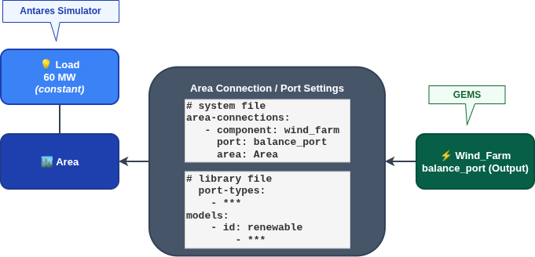

<div style="display: flex; justify-content: space-between; align-items: center;">
  <div style="text-align: left;">
    <a href="../../../..">Main Section</a>
  </div>
  <div style="text-align: right;">
    
  </div>
</div>

# Antares Simulator Hybrid studies

This page explains how to configure and run a **hybrid study** i.e. a study combining **GEMS components** and **Antares Simulator's Legacy Components**. In a hybrid study, the GEMS files are integrated into a Antares Simulator study’s directory structure, allowing Antares Simulator to incorporate GEMS components.

## Definition

A **hybrid study** is essentially a **Antares Simulator** study that includes additional **GEMS** input data (in the `input/` folder). The Antares Simulator executable (*antares-solver*) is able to run such a simulation, although the input directory contains **GEMS-specific files** (such as system, model libraries and data-series) describing GEMS components.

In this hybrid mode, the file `parameter.yml` is not used: if it exists, it will be ignored. Instead, the study relies on the Antares Simulator simulation settings. In summary, the **hybrid study’s** input directory merges the modeler files with the typical Antares files, and the Antares solver’s built-in GEMS interpreter handles the GEMS components during the simulation.

```text
Antares-Simulator-Study/
├── input/
│   ├── areas/
│   ├── bindingconstraints/
│   ├── ...
│   ├── model-libraries/     # Modeler libraries folder
│   ├── system.yml           # Modeler system file
│   └── data-series/         # Modeler dataseries folder
├── layers/
├── logs/
├── output/
├── settings/
├── user/
├── Desktop.ini
├── Logs.log
└── study.antares
```

## Running a hybrid study

## Hybrid connections: coupling GEMS Components with Legacy Areas

In a **hybrid study**, it is crucial to **connect each GEMS component to an appropriate Antares area** so that the component’s can participate in the simulation. Establishing this connection ensures that, for example, a GEMS generator’s output is included in the power balance of a specific Antares area.

In practical terms, connecting a GEMS **Generator** component to an Antares area injects the generator’s power output into that area’s balance equation (the supply-demand constraint). *Without this connection, the modeler component would remain isolated and not influence the solver’s optimization problem*. The following steps describe how to **link the modeler part to the solver part**:

#### Define the area-connection fields (in the library.yml file)

In order to successfully inject a GEMS component’s port into an Antares area, the port’s type must declare which field represents the power injection. This is configured in the model **library.yml** file (e.g., a **library.yml** in the *model-libraries* folder). Within the port type definition, an `area-connection` section specifies an `injection-field`. The `injection-field` designates which field of that port will be added to the connected area’s balance equation. For example, for a port type that carries power `flow`, it is defined in the library as follows:

```yaml
  port-types:
    - id: flow
      description: A port that transfers a power flow.
      fields:
        - id: flow
      area-connection:
        - injection-field: flow
```

The `area-connection` section is optional in general, but becomes mandatory when the port type is intended to be used in a **hybrid study**.

The `injection-field` explicitly designates which field of the port contributes to the area balance equation in the legacy Antares Simulator study.

#### Define the connections (in the system.yml file)

The `area-connections` section of the **system.yml** file is used to declare each connection between a GEMS component and a legacy Antares area.

For every component that should supply or interact with an Antares area, an entry is added specifying the component, the port through which it connects, and the target area name. The port must support the area injection field type. For example, to connect a component `wind_farm` to a legacy area `area1` through `wind_farm`’s port named `balance_port`, the following configuration is used:

```yaml
area-connections:
 - component: wind_farm
  port: balance_port
  area: area1
```

Explanation of fields:

- **component:** Refers to the `id` of the GEMS component to be connected. This `id` must match the one declared in the components section of the `system.yml` file. In this example, it refers to a component named `wind_farm`
- **port:** Specifies which port on the component is used to establish the connection to the Antares Simulator area. The corresponding port type must include an `area-connection` section in the model library definition, and must specify an `injection-field` that will be used by the solver
- **area:** Indicates the target Antares Simulator area. The component's output, through the defined port, will contribute to this Antares Simulator area’s balance constraint during simulation.

### How to run a hybrid study

After setting up the connections as described above, **running a hybrid study** is done in the same way as running a standard Antares simulation. The study can be opened or launched with Antares Simulator (using the GUI or the command-line solver). The presence of **system.yml** and **libraries** in the input folder will trigger the Antares solver’s GEMS interpreter to load those components. The solver will then construct a combined optimization problem that includes both the legacy elements (areas, thermal plants, hydro, etc.) and the new GEMS components defined by the user.

Once the run starts, it will simulate with the combined model. Results for the GEMS components (e.g., generation output of a custom component) will appear alongside the usual Antares results for areas, provided that output has been configured for those components (the GEMS framework will handle output storage in the study results).

## Simple example of a hybrid study

This section represents a simple example of a hybrid study that demonstrates how to integrate GEMS models into Antares Simulator. The example can be found in the [resources folder](https://github.com/AntaresSimulatorTeam/GEMS/tree/main/resources/Documentation_Examples) and covers a one-week time horizon.



<details>
<summary>Hybrid Study Example Details</summary>

<p>This consists of an area from Solver framework with a constant demand of 60 MW throughout one week and a wind farm component made from the <em>renewable</em> <strong>model</strong> from the <a href="https://github.com/AntaresSimulatorTeam/GEMS/blob/main/libraries/basic_models_library.yml"><strong>basic-models-library</strong></a>.</p>

<p>Concerning the connection between the area and the renewable component, it's configured by these yaml files:</p>

<p><strong>library.yml :</strong></p>

<pre><code class="language-yaml">
library:
  id: example_library

  port-types:
    - id: flow
      description: A port that transfers a power flow.
      fields:
      - id: flow
      area-connection:
      - injection-field: flow

  models:
    - id: renewable
      parameters:
      - id: generation
        time-dependent: true
        scenario-dependent: true
      ports:
      - id: balance_port
        type: flow
      port-field-definitions:
      - port: balance_port
        field: flow
        definition: generation
</code></pre>

<p><strong>system.yml :</strong></p>

<pre><code class="language-yaml">
system:
  id: system

  components:

    - id: wind_farm
      model: example_library.renewable
      parameters:
        - id: generation
          time-dependent: true
          scenario-dependent: true
          value: wind

  area-connections:
    - component: wind_farm
      port: balance_port
      area: Area
</code></pre>

</details>

Since the wind farm does not produce enough energy to fully cover the demand, the results include **Energy Not Served (ENS)**.

This example is intended solely to demonstrate how the **GEMS component**, when connected to an **Antares Simulator area**, emits a linear expression that is incorporated into the area’s balance constraint.

In this specific case, wind generation during the first hour is 20MW and demand is 60MW. As a result, the Antares area reports an ENS of 40MW, which is consistent with the balance shown in the simulation results.

## Limitations

When constructing hybrid studies, the following important constraints should be considered:

**Time Series Length**:

The time series data used in GEMS modeler components (for example, the generation profile of a renewable) must align with the Antares simulation horizon and resolution. In practice, this means the number of time steps and the granularity of GEMS time-dependent inputs should match the solver’s expectations (e.g., 8760 hourly values for a yearly hourly simulation). The hybrid solver will not accept a modeler time series that doesn’t fit the configured simulation timeframe.

**Integer/Binary Decision Variables**:

If any GEMS component introduces integer or binary decision variables (for instance, a component that has an on/off state or unit commitment logic), Antares must be run in MILP mode. Antares Simulator’s solver has to be set to Mixed-Integer Linear Programming (the unit commitment MILP option) to handle discrete variables. In hybrid mode, the solver will incorporate those binary/integer variables into the optimization, but only if the MILP solver is enabled. If running with continuous (LP) mode while using components that require integer decisions, the simulation will not handle them correctly. Thus, the study’s optimization settings must be configured for MILP (unit commitment) when needed.

<div style="display: flex; justify-content: space-between;">
  <div style="text-align: left;">
  <button type="button" style="background-color:#CCCCCC; border:none; padding:8px 16px; border-radius:4px; cursor:pointer">
    <a href="../1_pypsa" style="text-decoration:none; color: #000000">⬅️ Previous page</a>
  </button>
  </div>
  <button type="button" style="background-color:#AAAAFF; border:none; padding:8px 16px; border-radius:4px; cursor:pointer">
    <a href="../../../.." style="text-decoration:none; color: #FFFFFF">Home</a>
  </button>
  <div style="text-align: right;">
  <button type="button" style="background-color:#CCCCCC; border:none; padding:8px 16px; border-radius:4px; cursor:pointer">
    <a href="../../5_Examples/1_adequacy_example" style="text-decoration:none; color: #000000">Next page ➡️</a>
  </button>
  </div>
</div>

---

