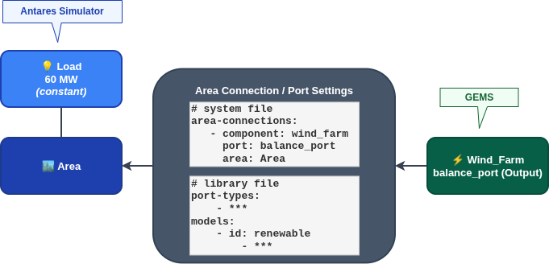

<div style="display: flex; justify-content: flex-end;">
  <a href="../../../..">
    
  </a>
</div>

# Antares Simulator Hybrid studies

This page explains how to configure and run a [**hybrid study**](https://antares-simulator.readthedocs.io/en/latest/user-guide/solver/08-hybrid-studies/) i.e. a study combining **GEMS components** and **Antares Simulator's Legacy Components**. In a hybrid study, the GEMS files are integrated into a Antares Simulator study’s directory structure, allowing Antares Simulator to incorporate GEMS components.

## Definition

A [**hybrid study**](https://antares-simulator.readthedocs.io/en/latest/user-guide/solver/08-hybrid-studies/) is essentially a **Antares Simulator** study that includes additional **GEMS** input data (in the `input/` folder). The Antares Simulator executable (*antares-solver*) is able to run such a simulation, although the input directory contains **GEMS-specific files** (such as system, model libraries and data-series) describing GEMS components.

In this hybrid mode, the file `parameter.yml` is not used: if it exists, it will be ignored. Instead, the study relies on the Antares Simulator simulation settings. In summary, the **hybrid study’s** input directory merges the modeler files with the typical Antares files, and the Antares solver’s built-in GEMS interpreter handles the GEMS components during the simulation.

```text
Antares-Simulator-Study/
├── input/
│   ├── areas/
│   ├── bindingconstraints/
│   ├── ...
│   ├── model-libraries/     # Modeler libraries folder
│   ├── system.yml           # Modeler system file
│   └── data-series/         # Modeler dataseries folder
├── layers/
├── logs/
├── output/
├── settings/
├── user/
├── Desktop.ini
├── Logs.log
└── study.antares
```

## Hybrid connections: coupling GEMS Components with Legacy Areas

In a **hybrid study**, a `area-connection` between a GEMS component and a Legacy Area means that the component contributes to the energy balance at the given node, through a given port (field).

In practical terms, connecting a GEMS **Generator** component to an Antares Legacy Area injects the generator’s power output into that area’s balance equation (the supply-demand constraint). *Without this connection, the GEMS component would remain isolated*.

The following steps describe how to **link the GEMS part of the study to the Legacy part**:

### Abstract definition of the area-connection field type (in the [library](../3_User_Guide/3_GEMS_File_Structure/2_library.md) file)

In order to successfully inject a GEMS component’s port into an Antares Legacy Area, the port’s type must declare which field will contribute to the optimization problem. This is configured in the [library](../3_User_Guide/3_GEMS_File_Structure/2_library.md) of the component's model (e.g. a file `model-libraries/library.yml`). 

The `area-connection` section is optional in general, but becomes mandatory when the port type is intended to be used in a **hybrid study**. It can accept 3 types of fields `injection-to-balance`, `spillage-bound` and `unsupplied-energy-bound` :

```yaml
port-types:
   - id: port-to-area
     fields:
        - id: field_to_balance
        - id: to-area-bound
        - id: from-area-bound
     area-connection:
        injection-to-balance: field_to_balance
        spillage-bound: to-area-bound
        unsupplied-energy-bound: from-area-bound
```

The nature of the contribution depends on the fields:

- `injection-to-balance`: the linear expression is injected in the balance constraint of the area.
- `spillage-bound`: the linear expression is added to the sum of all variables or linear expressions already used to bound the spillage in the constraint called "fictitious load".
- `unsupplied-energy-bound`: the linear expression is added to any linear expression already used to bound the unsupplied energy.

These fields are independent: you don't have to define all 3 at the same time, you can define only one. However, all three keys must be present in the `area-connection` section even if some values are left empty.

#### Single field case

It's not mandatory to connect one field for each `area-connection` entry, it's possible to define only one of them. For example, for a port type that carries power `flow_field` and only connects to the balance constraint, it is defined in the library as follows:

```yaml
port-types:
  - id: flow_port
    description: A port that transfers a power flow.
    fields:
      - id: flow_field
    area-connection:
      injection-to-balance: flow_field
      spillage-bound:
      unsupplied-energy-bound:

models:
  - id: my-production
    parameters:
      - id: flat_production
    ports:
      - id: balance_port
        type: flow_port
    port-field-definitions:
      - port: balance_port
        field: flow_field
        definition: flat_production
```

### Conventions on the sign of expressions

When connecting a component to an area, you must respect conventions on the sign of the linear expression contributed by the port field.

**Connecting to the balance constraint (`injection-to-balance`)**

- If you need to involve a **production**, make the expression **positive** (no `-` prefix):

```yaml
port-field-definitions:
  - port: balance_port
    field: flow_field
    definition: flat_production   # positive production
```

- If you need to involve a **load**, make the expression **negative** (prefix with `-`):

```yaml
port-field-definitions:
  - port: balance_port
    field: flow_field
    definition: -flat_load   # negative load
```

**Connecting to the spillage bound (`spillage-bound`)**

This connection is intended to limit the spillage optimization variable. The convention is the same as for the balance constraint: make the **production positive**, with no `-` prefix:

```yaml
port-field-definitions:
  - port: spillage_port
    field: to-area-bound
    definition: flat_production   # positive production
```

**Connecting to the unsupplied energy bound (`unsupplied-energy-bound`)**

This connection is intended to limit the unsupplied energy optimization variable. Here, make the **load positive**, with no `-` prefix:

```yaml
port-field-definitions:
  - port: unsup_energy_port
    field: from-area-bound
    definition: flat_load   # positive load
```

### Definition of the area-connections (in the [system](../3_User_Guide/3_GEMS_File_Structure/3_system.md) file)

The `area-connections` section of the system file is used to declare each connection between a GEMS component and an Antares Legacy Area.

For every component that should supply or interact with an Antares Area, an entry is added specifying the component, the port through which it connects, and the target area name. The port must belong to a port type that defines an `area-connection` section in the model library. For example, to connect a component `wind_farm` to a legacy area `area1` through `wind_farm`'s port named `balance_port`, the following configuration is used:

```yaml
area-connections:
  - component: wind_farm
    port: balance_port
    area: area1
```

Explanation of fields:

- **component:** Refers to the `id` of the GEMS component to be connected. This `id` must match the one declared in the components section of the `system.yml` file. In this example, it refers to a component named `wind_farm`
- **port:** Specifies which port on the component is used to establish the connection to the Antares Simulator area. The corresponding **port type** must include an `area-connection` section in the model library definition, and must specify at least one of `injection-to-balance`, `spillage-bound` or `unsupplied-energy-bound`
- **area:** Indicates the target Antares Simulator area. The component's output, through the defined port, will contribute to this Antares Simulator area's balance constraint during simulation

## Outputs

The study will generate two types of output files:

- [**Files similar to Legacy studies**](https://antares-simulator.readthedocs.io/en/latest/user-guide/solver/03-outputs/): outputs corresponding to the optimization results coming from the components created by the Legacy study.
- [**Simulation tables**](https://antares-simulator.readthedocs.io/en/latest/user-guide/modeler/03-outputs/): specific to modeler's components optimization, in the same output folder as the Legacy outputs. One simulation table for each optimization step (called `simulation_table--optim-nb-X`) will be generated.


## How to run a hybrid study

After setting up the connections as described above, **running a hybrid study** is done in the same way as [running a standard Antares simulation](https://antares-simulator.readthedocs.io/en/latest/user-guide/solver/10-command-line/). The study can be opened or launched with Antares Simulator (using the GUI or the command-line solver). The presence of the file `system.yml` and the folder `model-libraries` in the input folder will trigger the Antares solver’s GEMS interpreter to load those components. The solver will then construct a combined optimization problem that includes both the Legacy elements (areas, thermal plants, hydro, etc.) and the GEMS components defined by the user.

Once the run starts, it will simulate with the combined model. Results for the GEMS components (e.g., generation output of a custom component) will appear alongside the usual Antares results for areas, provided that output has been configured for those components (the GEMS framework will handle output storage in the study results).

## Simple example of a [hybrid study](https://github.com/AntaresSimulatorTeam/GEMS/tree/main/resources/Documentation_Examples/Hybrid_Study)

This section represents a simple example of a hybrid study that demonstrates how to integrate GEMS models into Antares Simulator. The example can be found in the [resources folder](https://github.com/AntaresSimulatorTeam/GEMS/tree/main/resources/Documentation_Examples) and covers a one-week time horizon.



<details>
<summary>Hybrid Study Example Details</summary>

<p>This consists of an area from Solver framework with a constant demand of 60 MW throughout one week and a wind farm component made from the <em>renewable</em> <strong>model</strong> from the <a href="https://github.com/AntaresSimulatorTeam/GEMS/blob/main/libraries/basic_models_library.yml"><strong>basic-models-library</strong></a>.</p>

<p>Concerning the connection between the area and the renewable component, it's configured by these yaml files:</p>

<p><strong>library.yml :</strong></p>

<pre><code class="language-yaml">
library:
  id: example_library

  port-types:
    - id: flow_port
      description: A port that transfers a power flow.
      fields:
        - id: flow_field
      area-connection:
        injection-to-balance: flow_field
        spillage-bound:
        unsupplied-energy-bound:

  models:
    - id: renewable
      parameters:
        - id: generation
          time-dependent: true
          scenario-dependent: true
      ports:
        - id: balance_port
          type: flow_port
      port-field-definitions:
        - port: balance_port
          field: flow_field
          definition: generation
</code></pre>

<p><strong>system.yml :</strong></p>

<pre><code class="language-yaml">
system:
  id: system

  components:
    - id: wind_farm
      model: example_library.renewable
      parameters:
        - id: generation
          time-dependent: true
          scenario-dependent: true
          value: wind

  area-connections:
    - component: wind_farm
      port: balance_port
      area: Area
</code></pre>

</details>

Since the wind farm does not produce enough energy to fully cover the demand, the results include **Energy Not Served (ENS)**.

This example is intended solely to demonstrate how the **GEMS component**, when connected to an **Antares Simulator area**, emits a linear expression that is incorporated into the area’s balance constraint.

In this specific case, wind generation during the first hour is 20MW and demand is 60MW. As a result, the Antares area reports an ENS of 40MW, which is consistent with the balance shown in the simulation results.

## Limitations

When constructing hybrid studies, the following important constraints should be considered:

**Time Series Length:**

The time series data used in GEMS modeler components (for example, the generation profile of a renewable) must align with the Antares simulation horizon and resolution. In practice, this means the number of time steps and the granularity of GEMS time-dependent inputs should match the solver’s expectations (e.g., 8760 hourly values for a yearly hourly simulation). The hybrid solver will not accept a modeler time series that doesn’t fit the configured simulation timeframe.

**Integer/Binary Decision Variables:**

If any GEMS component introduces integer or binary decision variables (for instance, a component that has an on/off state or unit commitment logic), Antares must be run in MILP mode. Antares Simulator’s solver has to be set to Mixed-Integer Linear Programming (the unit commitment MILP option) to handle discrete variables. In hybrid mode, the solver will incorporate those binary/integer variables into the optimization, but only if the MILP solver is enabled. If running with continuous (LP) mode while using components that require integer decisions, the simulation will not handle them correctly. Thus, the study’s optimization settings must be configured for MILP (unit commitment) when needed.
**Scenario dependency of Variables**:
In Antares Simulator Legacy mode, each MC scenario is optimized separately. Thus, hybrid studies cannot contain scenario-independent variables. If you try to use such a variable in hybrid mode, the solver will fail.