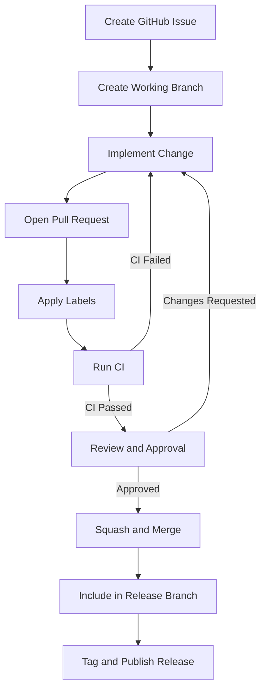

# GEMS Standard Development and Release Workflow

This document defines the **standard workflow for development, pull
requests, branching, versioning, tagging, and packaging** across all
official **GEMS ecosystem repositories**.

It applies to repositories related to:

- [GemsPy](https://github.com/AntaresSimulatorTeam/GemsPy)
- [Antares2GEMS Converter](https://github.com/AntaresSimulatorTeam/AntaresLegacyModels-to-GEMS-Converter)
- [PyPSA2GEMS Converter](https://github.com/AntaresSimulatorTeam/PyPSA-to-GEMS-Converter)
- [GEMS Language, Documentation, Libraries and Taxonomies](https://github.com/AntaresSimulatorTeam/GEMS)

The objective of this workflow is to ensure:

- consistent repository management
- predictable releases
- controlled versioning
- reliable CI/CD validation
- clear traceability of changes

------------------------------------------------------------------------

# 1. Development Starting Point

All changes **MUST start from a tracked GitHub Issue** created in one of the official **GEMS** repositories listed in this document.

The issue **MUST include**:

- purpose of the change
- compatibility impact
- related process ID (if applicable)

Pull Requests **MUST NOT be opened without an associated issue**, except
for:

- trivial documentation fixes
- emergency hotfixes

------------------------------------------------------------------------

# 2. Branch Management System

The repositories listed above use the following core branches:

- `main` → production / released state
- `develop` → integration branch for next release

Direct commits to main and develop are NOT allowed.
All changes **MUST be introduced through Pull Requests**.

------------------------------------------------------------------------

## 2.1 Core Branch Roles

### `main`

- Contains only released versions
- Each commit corresponds to a release
- Every release commit MUST be tagged (vX.Y.Z)
- Fully stable and production-ready at all times `develop`

### `develop`

- Contains all changes planned for the next release
- Acts as the integration branch
- Updated continuously via PRs
- May be unstable between releases

## 2.1 Branch Types

 | Branch Type|        Purpose|
|  ------------------ |-----------------------------------------|
  `feature/...`      |New functionality|
  `bugfix/...`       |Bug fixes|
  `refactor/...`     |Internal restructuring|
  `perf/...`         |Performance improvements|
  `docs/...`         |Documentation changes|
  `chore/...`        |Maintenance tasks or dependency updates|
  `release/vX.Y.Z`   |Release preparation|
  `hotfix/vX.Y.Z`    |Urgent post-release corrections|

------------------------------------------------------------------------

## 2.2 Branch Naming Convention

Branch names **MUST follow** the format:

    <branch-type>/<short-description>

Examples:

    feature/add-storage-operator
    bugfix/fix-parser-validation
    refactor/model-builder-cleanup
    perf/improve-study-loading
    docs/update-language-version-table
    chore/update-python-dependencies
    release/v0.3.4
    hotfix/v0.3.5

Branch names **SHOULD**:

- be short
- be descriptive
- use hyphen separation

------------------------------------------------------------------------

# 3. Pull Request Creation Rules

- Create branch from `develop`

- Implement change

- Open PR targeting `develop` and link it to GitHub Issue

- Apply labels and complete PR template

- Pass CI and review

------------------------------------------------------------------------

## 3.1 PR Title Convention

PR titles **MUST follow the format**:

    [PR] <PR-id>: <short description> <proccess-id>

Examples:

    [PR] 001: Add support for new language operator GP-01
    [PR] 002: Add support for new Antares legacy model A2G-03
    [PR] 003: Adapt converter to new PyPSA API P2G-04
    [PR] 004: Clarify GEMS Language folder structure GR-06

If no process ID exists, a **repository-specific prefix MAY be used
temporarily**.

------------------------------------------------------------------------

# 4. Pull Request Description Rules

Each PR **MUST include the following sections**.

    ## Summary
    Describe the purpose of the change.

    ## Related Issue
    Link the GitHub issue.

    ## Scope
    List affected components or modules.

    ## Compatibility Impact
    State whether the change is breaking, backward-compatible, or internal only.

    ## Testing
    Describe unit, integration, and end-to-end tests executed.

    ## Release Impact
    State the expected release label: major, minor, or patch.

    ## Dependencies
    List dependent PRs or state "None".

Additional requirements:

- If behavior changes, the **new behavior MUST be described
    explicitly**
- If behavior does not change, this **MUST also be stated**

------------------------------------------------------------------------

# 5. Pull Request Labeling Convention

Every PR **MUST include labels describing**:

- the **type of change**
- the **release impact**

------------------------------------------------------------------------

## 5.1 Change Type Labels

  |Label|                  Meaning|
  |---------------------- |---------------------------|
  `type:feature`         |New feature|
  `type:bugfix`          |Bug fix
  `type:refactor`        |Internal restructuring
  `type:performance`     |Performance improvement
  `type:documentation`   |Documentation changes
  `type:dependency`      |Dependency updates
  `type:hotfix`          |Critical post-release fix

------------------------------------------------------------------------

## 5.2 Release Impact Labels

**Exactly one** release label **MUST be assigned**.

  |Label|             Meaning|
  |----------------- |-----------------|
  `release:major`   |Breaking change
  `release:minor`   |New feature
  `release:patch`   |Bug fix
  `release:none`    |Internal change

------------------------------------------------------------------------

# 6. Review Rules

A Pull Request **MAY be merged only when all conditions are satisfied**:

- CI pipeline passes
- required labels are present
- PR description is complete
- at least one maintainer approves the PR
- all review comments are resolved

For breaking changes or release branches, **two approvals are
recommended**.

------------------------------------------------------------------------

# 7. Merge Rules

| Target Branch | Strategy       | Notes                            |
| ------------- | -------------- | -------------------------------- |
| `develop`     | Squash & Merge | All PRs                          |
| `main`        | Merge commit   | Only from `hotfix` or `develop` |

------------------------------------------------------------------------

# 8. Release Branch Rules

No dedicated release branch is used.

The release process is:

- `develop` accumulates all changes (PR's) for the next version
- When the release is ready merge `develop` into `main`
- Tag the resulting commit on `main` - `vX.Y.Z`
- Publish the release

After release development continues on `develop` branch.

------------------------------------------------------------------------

# 9. Tagging Rules

Official releases **MUST be tagged from the corresponding release
branch**.

Tag format:

    vX.Y.Z

Examples:

    v1.0.0
    v0.3.4
    v2.1.7

------------------------------------------------------------------------

Tags **MUST be created from** `main`.

# 10. Versioning Rules

All repositories **MUST follow Semantic Versioning**:

    MAJOR.MINOR.PATCH

## Common upgrade rules

Major → breaking changes\
Minor → backward compatible features\
Patch → bug fixes or internal improvements

------------------------------------------------------------------------

# 11. Changelog Rules

Each repository **MUST maintain a changelog**.

Recommended sections:

- Added
- Changed
- Fixed
- Removed
- Deprecated

Every release **MUST include a changelog entry before tagging**.

In repositories that host multiple independently versioned entities,
a dedicated changelog will be provided for each entity.

------------------------------------------------------------------------

# 12. Python Package Rules

???

------------------------------------------------------------------------

# 13. Hotfix Rules

If a release contains a critical issue:

- Create branch from `main` - `hotfix/vX.Y.Z`
- Apply fix and open PR to main
- Merge and tag new patch release `vX.Y.(Z+1)`
- **Mandatory:** merge `hotfix` back into `develop`

------------------------------------------------------------------------

# 14. Rollback Rules

If a release is broken:

- it may be reverted in `main`
- a corrective patch release must be prepared
- published packages may be yanked

Rollback actions **MUST be documented in release notes or changelog**.

------------------------------------------------------------------------

# 15. CI/CD Rules

All repositories **defines certain CI pipelines**.

Typical checks include:

- formatting
- import sorting
- type checking
- unit tests
- integration tests
- end-to-end tests
- documentation build

PRs **cannot be merged if required checks fail**.

------------------------------------------------------------------------

# 16. Recommended Minimal PR Lifecycle

------------------------------------------------------------------------
