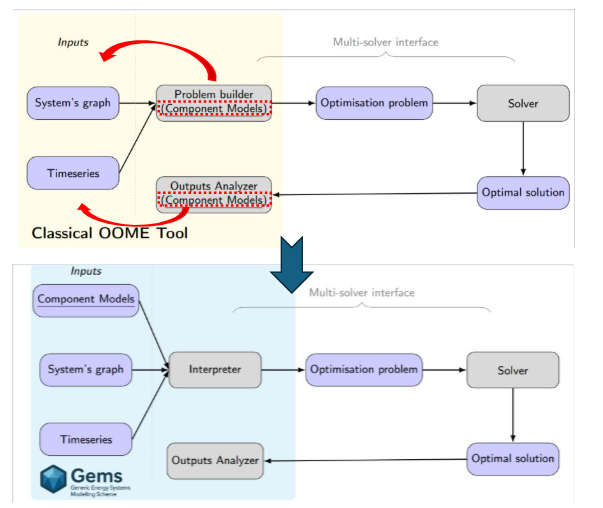

  

    <a href="../../index.md">Main Section</a>
  

  

    
  

# Introduction to GEMS and Architecture Principles

**GEMS** (Generic Energy systems Modeling Scheme) is an **open-source framework** developed to advance the capabilities of the Antares Simulator.

The primary motivation for the GEMS project is to move beyond classic Object-Oriented Modelling Environment (OOME) architectures by allowing by improving **versatility, stability, maintainability and **interoperability****.

## GEMS Definition and Role

More precisely, GEMS consists of:
*   **A high-level modelling language** designed to configure and extend models of components
*   **A data structure** used to represent energy systems

This framework is a **GBOML** (Graph Based Optimization Modelling Language) specifically designed to handle **MILP** (Mixed Integer Linear Programming).

## GEMS Interpreters

GEMS uses interpreters to translate the models and data into an optimization problem:
*   The **Modeler** is the GEMS interpreter integrated within Antares Simulator
*   **GemsPy** is a separate Python interpreter designed for GEMS to perform simulation and optimization.

## GEMS Architecture and Input Files

The GEMS architecture enforces a structured approach, separating modeling logic, system configuration, optimization workflow, and business intelligence into four distinct "bounded contexts".

The core inputs for defining the optimization problem are external configuration files:

| Component | File | Description & Role |
| :--- | :--- | :--- |
| **Model Libraries** | `library.yml` | Define the **Models**, which are **abstract representation of a type of object** we want to simulate inside our own study. This file includes optimization **variables**, **mathematical constraints**, **objective contributions**, **parameters**, and **ports**. |
| **System** | `system.yml` | Defines the **Components**, which are **numerical instantiation of models**. It links to a specific model ID and defines the numerical values for its parameters. It also defines the **connections** between components via ports, forming the system graph. |
| **Timeseries** | `timeseries.tsv` | Contains the numerical data for parameters that are dependent on time and scenario. |

## Architectural Breakthrough

This architecture represents a fundamental change from classical OOME architectures, where problem definition is typically located inside the *Problem builder* and the tool itself.

  

By configuring the entire optimization problem using these **external YAML files**, the architecture achieves its key principles:

- **Versatile Modelling**: Optimization problem can be configured easily without **rewriting the core code**
- **Interoperability**: The GEMS format facilitates seamless interaction with external tools, demonstrated, for example, by the conversion and simulation of PyPSA studies using GemsPy

---
**Navigation**

  

    <a href="1_context_GEMS.md">Previous Section</a>
  

    

    <a href="../../index.md">Back to Home</a>
  

  

    <a href="3_release_notes.md">Next Section</a>
  

---

© GEMS (LICENSE)