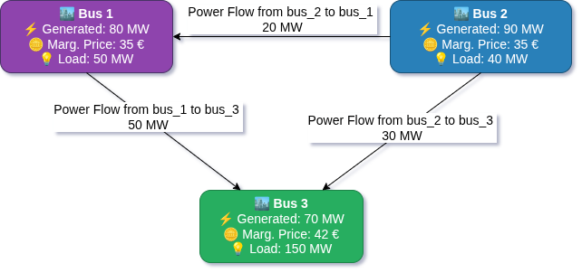
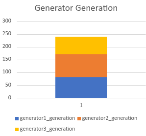
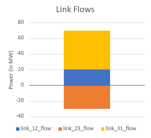
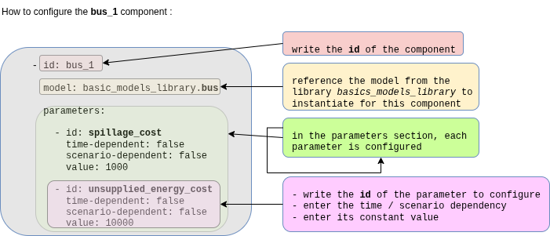
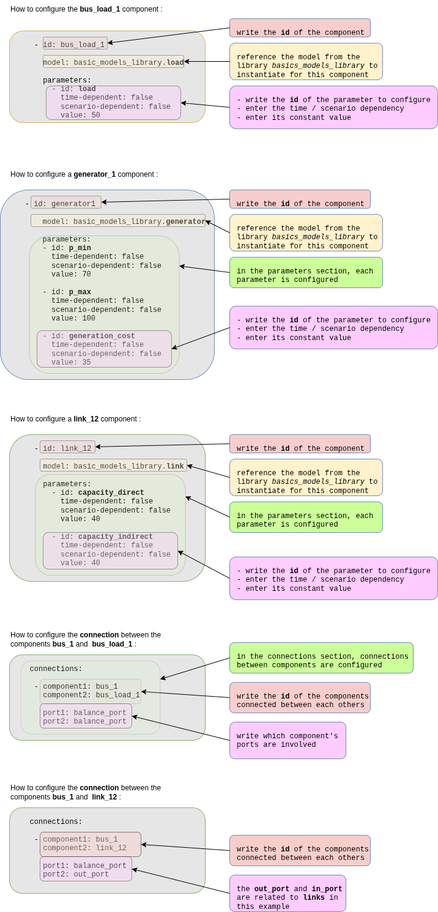

# Quick-start example 1: three-bus adequacy system

## Overview and problem description

This tutorial demonstrates **adequacy** modeling using a simplified three-bus meshed network over **one single time-step**. The example is intended to illustrate modeling concepts and should not be interpreted as a realistic system representation; however, it provides a foundation for developing more detailed and realistic models.

The study folder is on the [GEMS Github repository](https://github.com/AntaresSimulatorTeam/GEMS/tree/main/resources/Documentation_Examples/QSE/QSE_1_Adequacy).

### Adequacy definition

**Adequacy** is the ability of the electric grid to satisfy the end-user power demand at all times. The main challenge is to get the balance between the electric **Production** (generator, storage) and **Consumption** (load, spillage) while respecting the **limitations of the grid**.

<p align="center">
  
</p>

### Problem description

The following diagram represents the simulated [system](https://github.com/AntaresSimulatorTeam/GEMS/blob/main/resources/Documentation_Examples/QSE/QSE_1_Adequacy/input/system.yml):
<p align="center">
  
</p>

??? note "Problem description in detail"

    Time Horizon:

    - This example considers a single one-hour time step.

    Network Components:

    - 3 Buses (Regions 1, 2, 3 forming a triangle)
    - 3 Links (connecting each pair of regions)
    - 3 Generators (different capacities and costs)
    - 3 Loads (fixed demands)

    In this example, the power flows on the links are constrained only by thermal capacities.

    Generation:
    - `Generator 1` (Bus 1): 70-100 MW capacity, 35 €/MWh cost
    - `Generator 2` (Bus 2): 50-90 MW capacity, 25 €/MWh cost
    - `Generator 3` (Bus 3): 50-200 MW capacity, 42 €/MWh cost

    Demand:

    - Bus 1: 50 MW
    - Bus 2: 40 MW
    - Bus 3: 150 MW
    - Total Load: 240 MW

    Transmission Capacities:
    
    - Link 1-2: 40 MW (bidirectional)
    - Link 2-3: 30 MW (bidirectional)
    - Link 3-1: 50 MW (bidirectional)

    Economic Parameters:

    - Spillage cost: 1000 €/MWh (penalty for wasted energy)
    - Unsupplied energy cost: 10000 €/MWh (high penalty for unmet demand)

## The GEMS study

### Files Structure

The following block represents the GEMS Framework study folder structure.

```text
QSE_1_adequacy/
├── input/
│   ├──model-libraries/
│   │  └──  basic_models_library.yml 
│   ├── system.yml
│   └── data-series/
│       └──  ...
└── parameters.yml
```

The example study makes use of models provided by the [GEMS library](https://github.com/AntaresSimulatorTeam/GEMS/tree/f5c772ab6cbfd7d6de9861478a1d70a25edf339d/libraries). For maintainability reasons, the library is stored separately in the repository and is not included directly in the example study. Consequently, users must copy the [`basic_models_library.yml`](https://github.com/AntaresSimulatorTeam/GEMS/blob/f5c772ab6cbfd7d6de9861478a1d70a25edf339d/libraries/basic_models_library.yml) file into the example study directory (`QSE_1_adequacy/input/model-libraries/`) prior to execution.

Since this example performs the simulation over a single time step, the data-series folder does not contain any time-series data.

Simulation options can be configured in the `parameters.yml` file. For more details on available simulation options, refer to the [following link](https://github.com/AntaresSimulatorTeam/Antares_Simulator/blob/develop/docs/user-guide/modeler/04-parameters.md).

### Relations between library and system files

The following diagram depicts the structural relationships between the [library file](https://github.com/AntaresSimulatorTeam/GEMS/blob/main/libraries/basic_models_library.yml) and the [system file](https://github.com/AntaresSimulatorTeam/GEMS/blob/main/resources/Documentation_Examples/QSE/QSE_1_Adequacy/input/system.yml):

<p>
  
</p>

???+ info "Library and System relations in details"

    The previous diagram represents the `system.yml` file, where users can instantiate components (such as buses, links, generators, etc.) and connect them via ports to form the optimization graph. It also illustrates the relationship between the library file and the system file for this adequacy example.

    - Instantiation of components `bus_1`, `bus_load_1`, `generator_1`, and `link_12` is shown, as well as the connections between `bus_1` and `bus_load_1`, and between `bus_1` and `link_12`.
    - The complete system file can be found [in this repository](https://github.com/AntaresSimulatorTeam/GEMS/blob/15b4821113a09a417b73d00b3bc24f819ef44c99/doc/5_Examples/QSE/QSE_1_Adequacy/input/system.yml).

## Running the GEMS study with Antares Modeler

!!! warning
    It's recommended to run this GEMS study with Antares Modeler or GemsPy. Indeed, Antares Solver's hybrid mode manages GEMS objects, but there are some limitations regarding the temporal structure (8,760 timestep timeseries and weekly decomposition) related to the Legacy part of Antares Solver.

    For more information about the hybrid mode of Antares Solver, see the [Hybrid Study](../../interoperability/hybrid/) section.

1. Download [QSE_1_Adequacy](https://github.com/AntaresSimulatorTeam/GEMS/tree/documentation/get_started_quick_examples/resources/Documentation_Examples/QSE/QSE_1_Adequacy)
2. Copy [`basic_models_library.yml`](https://github.com/AntaresSimulatorTeam/GEMS/blob/f5c772ab6cbfd7d6de9861478a1d70a25edf339d/libraries/basic_models_library.yml) into the `QSE_1_adequacy/input/model-libraries/`
3. Get Antares Modeler installed through this [tutorial](../installation/modeler-installation.md)
4. Locate **bin** folder
5. Open the terminal
6. Run these command lines :

```bash
# Windows
antares-modeler.exe <path-to-study>

# Linux
./antares-modeler <path-to-study>
```

## Outputs

The results are available in the csv file `QSE_1_Adequacy/output/simulation_table--YYYYMMDD-HHMM.csv`

The simulation outputs contain the optimised value of optimisation problem variables, the status of all constraints and bounds, as well as user-defined extra output, as described on the [following page](../../user-guide/outputs/simulation-table.md).

The power flows between buses can be visualized as follows:



???+ info "Outputs in details"

    By utilising the extra output feature, the marginal price is obtained as the dual value of the power balance constraint at each bus:

    - `bus_1`: 35 €/MWh, based on the generation cost of `generator_1`.
    - `bus_2`: 35 €/MWh, since `generator_2` is operating at its maximum capacity. The next increment of 1 MWh is therefore produced by `generator_1`.
    - `bus_3`: 42 €/MWh, based on the generation cost of `generator_3`.

    The following graphs show the merit order of the generators and link flows:

    

    *This graph shows the power output of each generator in the system, illustrating how the optimiser allocates generation based on cost and capacity constraints.*

    

    *Above the blue abscissa axis, the flow represents import; below, it represents export.*

## Further in-depth explanations

### Models Library

The system of the **Three-bus Adequacy** example relies on models defined in the GEMS library file [`basic_models_library.yml`](https://github.com/AntaresSimulatorTeam/GEMS/tree/f5c772ab6cbfd7d6de9861478a1d70a25edf339d/libraries). These models encode the decision variables, objective-function contributions, and constraints that collectively form the optimisation problem.

The complete mathematical formulation corresponding to this example - including decision variables, parameters, objective function, and constraints - is detailed in the following document: **[detailed mathematical formulation and expressions](./adequacy-math-model.md)**.

### System file configuration

The description of an energy system is the combination of a model library and a graph of components (instantiation of models) described in the system file.
For example, for the component bus_1, here is an extract of the [system file](https://github.com/AntaresSimulatorTeam/GEMS/blob/main/resources/Documentation_Examples/QSE/QSE_1_Adequacy/input/system.yml) :



???+ info "Full system file description for the Three-bus system - Simple Adequacy Example"

    The following diagrams explain the structure of the system file for the Three-bus system - Simple Adequacy Example :

    

