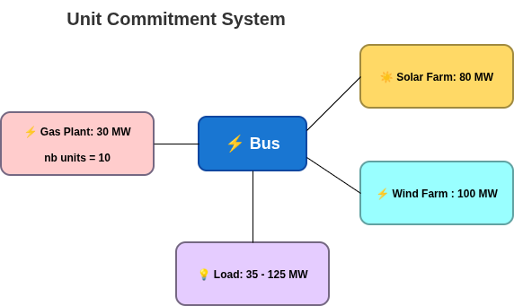
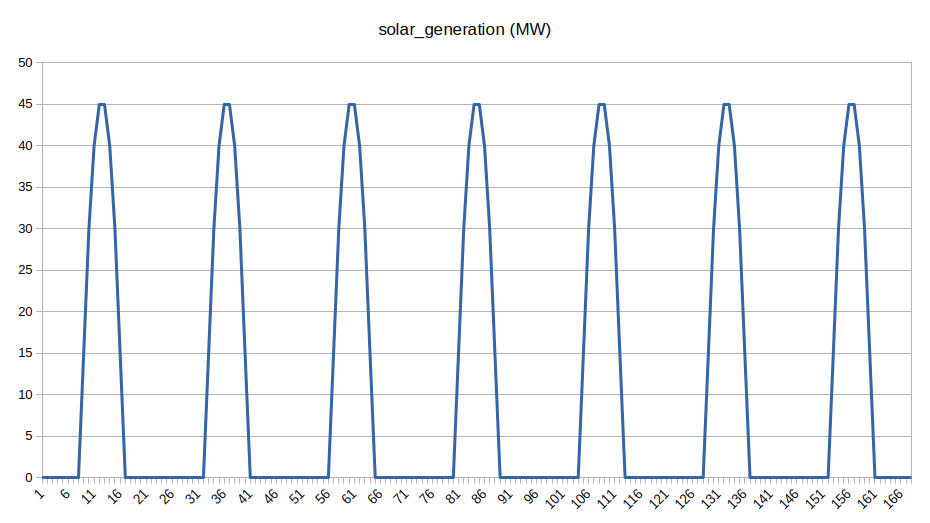
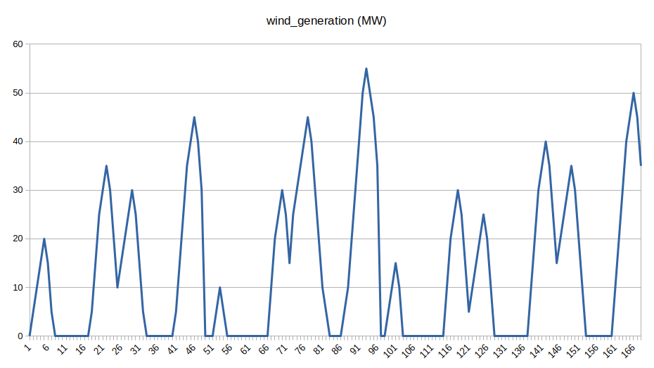
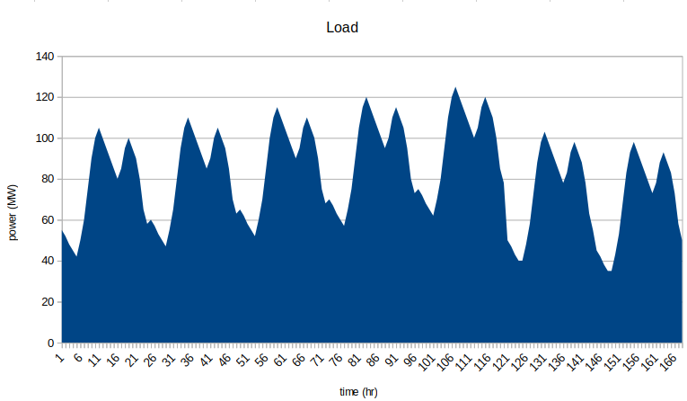
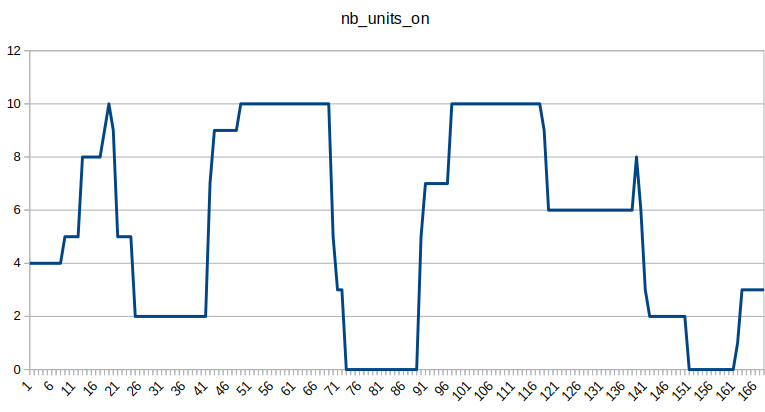
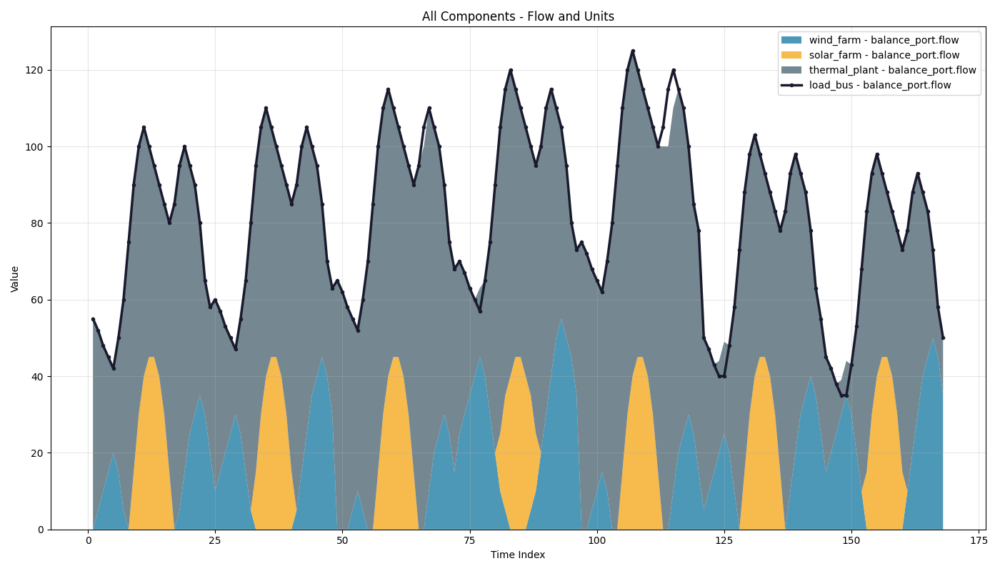

# Quick-start example 2: Unit Commitment - Simple Example

## Overview

This tutorial demonstrates a simple example of a **unit commitment** problem stated with GEMS. Unit commitment involves determining the optimal number of dispatchable generating units at each time period in order to meet residual demand at the lowest possible cost. This example is intended to illustrate modelling concepts and should not be interpreted as representing a realistic system.

The study folder is on the [GEMS Github repository](https://github.com/AntaresSimulatorTeam/GEMS/tree/main/resources/Documentation_Examples/QSE/QSE_2_Unit_Commitment).

!!! warning 
    This study requires Antares Simulator version &gt; {{ antares_simulator_version }}.
    
    You can find the latest version on the[ official releases page](https://github.com/AntaresSimulatorTeam/Antares_Simulator/releases).

### Files Structure

The diagram below describe the file structure of the [study](https://github.com/AntaresSimulatorTeam/GEMS/tree/main/resources/Documentation_Examples/QSE/QSE_2_Unit_Commitment).

```text
QSE_2_Unit_Commitment/
├── input/
│   ├── system.yml
│   ├── model-libraries/
│   │   └── antares_legacy_models.yml
│   └── data-series/
│       ├── load.csv
│       ├── solar.csv
│       └── wind.csv
└── parameters.yml
```

### Problem Description



The *Unit Commitment* problem here involves determining the on/off schema and dispatch of thermal units required to ensure adequate production and load balancing, given the intermittent nature of solar and wind generation. Modelling the thermal units takes into account dynamic constraints and non-proportional costs, such as start-up and fixed costs.

???+ info "System Overview"

    - **Bus** (central node for power balance)
        - `spillage_cost`: 1000 €/MWh
        - `unsupplied_energy_cost`: 10000 €/MWh
    - **Thermal cluster** (dispatchable)
        - 10 units, each 10 MW (100 MW total capacity)
        - All parameters (min/max power, costs, min up/down, number of units) are set in `system.yml`
    - **Solar plant**
        - Generation profile from `solar.csv` timeseries :
        - 
    - **Wind plant**
        - Generation profile from `wind.csv` timeseries :
        - 
    - **Load**
        - Variable demand (35–125 MW) from `load.csv` timeseries :
        - 

    - **Time Horizon:** 1 week, hourly resolution (168 hours)
    - The diagram above shows the connections between these components.

## Running the GEMS study with Antares Modeler

!!! warning
    It's recommended to run this GEMS study with Antares Modeler or GemsPy. Indeed, Antares Solver's hybrid mode manages GEMS objects, but there are some limitations regarding the temporal structure (8,760 timestep timeseries and weekly decomposition) related to the Legacy part of Antares Solver.

    For more information about the hybrid mode of Antares Solver, see the [Hybrid Study](../../interoperability/hybrid/) section.

Instructions to run this GEMS study with [Antares Simulator](https://github.com/AntaresSimulatorTeam/Antares_Simulator/releases) are available below.

???+ info "Detailed steps for running GEMS study with Antares Modeler"

    1. Download [QSE_2_unit_commitment](https://github.com/AntaresSimulatorTeam/GEMS/tree/documentation/get_started_quick_examples/resources/Documentation_Examples/QSE/QSE_2_unit_commitment)
    1. Copy [`antares_legacy_models.yml`](https://github.com/AntaresSimulatorTeam/GEMS/blob/f5c772ab6cbfd7d6de9861478a1d70a25edf339d/libraries/antares_legacy_models.yml) into the `QSE_2_unit_commitment/input/model-libraries/`
    1. Get Antares Modeler installed through this [tutorial](../installation/modeler-installation.md)
    1. Locate **bin** folder
    1. Open the terminal
    1. Run these command lines:

        **Windows**

        ```
        antares-modeler.exe <path-to-study>
        ```

        **Linux**

        ```
        ./antares-modeler <path-to-study>
        ```

    The results will be available in the folder `<study_folder>/output`.

## Outputs

This graph illustrates how the number of thermal units generating power changes over the simulation week, reflecting the **unit commitment** feature. At night, when solar generation is unavailable, more thermal units are solicited to meet demand. Around midday, increased solar output often reduces the need for thermal generation, resulting in fewer thermal units operating.



Focus on the flows of all components:



???+ info "Key outputs variables in the Simulation Table"

    The simulation outputs are saved in `output/simulation_table--<timestamp>.csv`. This table gives the key to understand the different output variables relevant to this example of unit commitment.

    | Variable | Description |
    |----------|-------------|
    | `thermal,nb_units_on` | **Number of units currently ON** (0-10). This is the key output showing how many thermal units are committed at each hour. |
    | `thermal,nb_starting` | Number of units starting up at this hour |
    | `thermal,nb_stopping` | Number of units shutting down at this hour |
    | `thermal,generation` | Total power output from the thermal cluster (MW) |

## Further in-depth explanations

### Mathematical formulation

The mathematical modelling used for this study case is inspired from Antares Simulator legacy approach: [Antares Simulator documentation](https://xwiki.antares-simulator.org/xwiki/bin/view/Reference%20guide/4.%20Active%20windows/5.Optimization%20problem/).

### Library File

The library file [**antares_legacy_models.yml**](https://github.com/AntaresSimulatorTeam/GEMS/blob/main/libraries/antares_legacy_models.yml) defines the main component [models](../../user-guide/file-structure/library.md#models) used in this example:

- **bus**: Central node with power balance constraint, spillage, and unsupplied energy variables.
- **load**: Consumes power (negative flow into the bus).
- **thermal**: Dispatchable thermal cluster with unit commitment logic (integer variables for units ON/starting/stopping).
- **renewable**: Non-dispatchable generation for solar and wind plants.

### System File

The description of an energy system is the combination of a model library and a graph of components (instantiation of models) described in the system file. This part contains an extract of this **system file**.

???+ info "Details of the `system.yml` File"

    The next lines are an extract of the whole system file of this study:

    ```yaml
    system:
      id: system
      components:
        - id: bus1
          model: antares_legacy_models.area

          parameters:
            - id: spillage_cost
              time-dependent: false
              scenario-dependent: false
              value: 1000
            - id: unsupplied_energy_cost
              time-dependent: false
              scenario-dependent: false
              value: 10000

        - id: load_bus
          model: antares_legacy_models.load

          parameters:
            - id: load
              time-dependent: true
              scenario-dependent: true
              value: load

        - id: thermal_plant
          model: antares_legacy_models.thermal
          parameters:
            - id: min_power_per_unit
              time-dependent: false
              scenario-dependent: false
              value: 3
            - id: max_power_per_unit
              time-dependent: false
              scenario-dependent: false
              value: 10
            - id: generation_cost
              time-dependent: false
              scenario-dependent: false
              value: 30
            - id: startup_cost
              time-dependent: false
              scenario-dependent: false
              value: 1000
            - id: fixed_cost
              time-dependent: false
              scenario-dependent: false
              value: 100
            - id: min_up_duration
              time-dependent: false
              scenario-dependent: false
              value: 12
            - id: min_down_duration
              time-dependent: false
              scenario-dependent: false
              value: 12
            - id: cluster_max_generation
              time-dependent: false
              scenario-dependent: false
              value: 100
            - id: num_units
              time-dependent: false
              scenario-dependent: false
              value: 10
            - id: spinning
              time-dependent: false
              scenario-dependent: false
              value: 0
            - id: cluster_min_gen_modulation
              time-dependent: false
              scenario-dependent: false
              value: 0

        - id: solar_farm
          model: antares_legacy_models.renewable
          parameters:
            - id: nominal_capacity
              time-dependent: false
              scenario-dependent: false
              value: 50
            - id: num_units
              time-dependent: false
              scenario-dependent: false
              value: 1
            - id: available_power
              time-dependent: true
              scenario-dependent: true
              value: solar

        - id: wind_farm
          model: antares_legacy_models.renewable
          parameters:
            - id: nominal_capacity
              time-dependent: false
              scenario-dependent: false
              value: 35
            - id: num_units
              time-dependent: false
              scenario-dependent: false
              value: 1
            - id: available_power
              time-dependent: true
              scenario-dependent: true
              value: wind

      connections:

        - component1: bus1
          component2: load_bus
          port1: balance_port
          port2: balance_port
        - component1: bus1
          component2: thermal_plant
          port1: balance_port
          port2: balance_port
        - component1: bus1
          component2: solar_farm
          port1: balance_port
          port2: balance_port
        - component1: bus1
          component2: wind_farm
          port1: balance_port
          port2: balance_port
    ```

