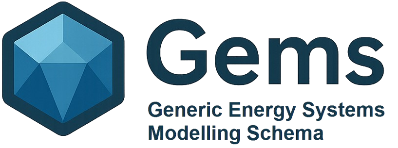

  

# Frequently Asked Questions

## General Questions

### Do GEMS interpreters have a GUI?

Currently, there is no GUI integrated into the [Antares Simulator repository](https://github.com/AntaresSimulatorTeam/Antares_Simulator) that is compatible with GEMS. However, [AntaresWeb](https://github.com/AntaresSimulatorTeam/AntaREST)'s compatibility with GEMS is currently under development and will be available in future releases.

### Can I use GEMS components inside a Legacy Study ?

Yes, you can run hybrid studies (a Legacy study with GEMS components inside) with Antares Legacy. For a pratical tutorial, refer to the [Hybrid Study Section](../interoperability/hybrid/).

### Can I model unit commitment with GEMS?

Yes, unit commitment is fully supported in GEMS. For a practical example, refer to the [Unit Commitment tutorial](../getting-started/quick-start/unit-commitment.md).

## Modelling & Simulation

### What study cases may be exported/converted in GEMS format?

Converters are currently being developed to export either PyPSA or Antares Legacy test cases in the GEMS format/data structure. More information available in the [Interoperability](../interoperability/pypsa-to-gems-converter/overview.md) section.

### How do I get started with GEMS modeling?

Start with the [Getting Started guide](../getting-started/installation/modeler-installation.md) which covers installation and basic setup. Then explore the [User Guide](../user-guide/introduction.md) for detailed modeling concepts.

### Where can I find examples?

The [Examples section](../examples/adequacy-example.md) contains various use cases and complete working models to help you understand GEMS capabilities.

## Support

### How do I report issues or get support?

Visit the [Support & Contributing section](./contact.md) for contact information and support channels.

