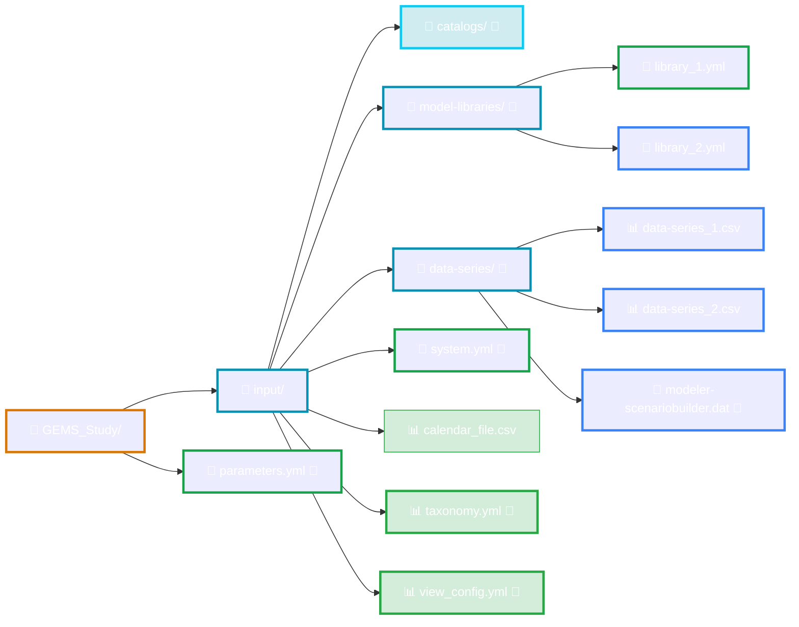

# File Structure

This section provides a high-level overview of the specific files used by [**GEMS framework**](../../index.md) and how they collectively describe a complete GEMS study.

These files describe the models logic, input data, scenarios, solver settings, and output representations. A summary of the expected files and their roles is provided in the [GEMS Architecture](../../overview/architecture.md).

Understanding how these files fit together is essential for building, modifying, maintaining and analyzing GEMS studies.

The diagram below illustrates the typical organisation of a GEMS study:

*Click on the elements with the 🔗 emoji in order to be redirected to their dedicated documentation*

The following pages of this section describe each file and folder in detail. Each page focuses on the role of a specific file, its expected structure, and how it interacts with the rest of the file to form a consistent and executable GEMS study.