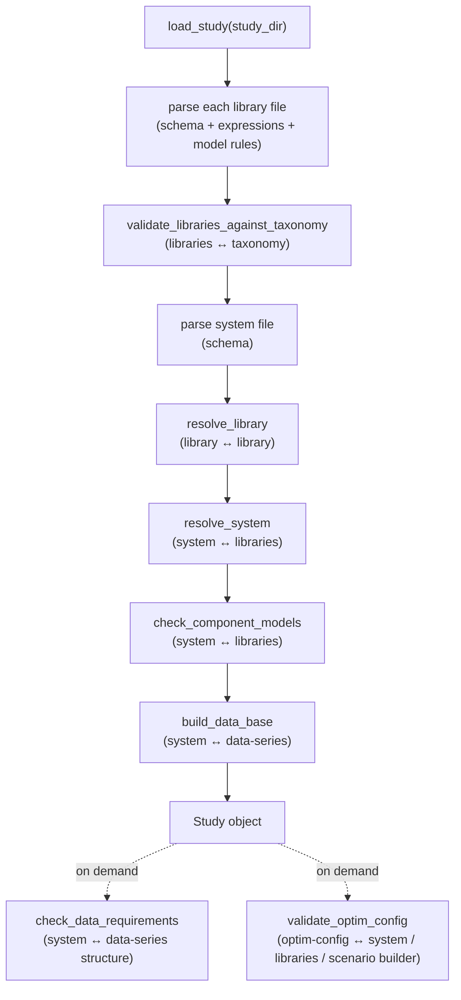

# Validation of a GEMS Study

This page gathers every consistency check that the [GemsPy](https://github.com/AntaresSimulatorTeam/GemsPy) interpreter (`gems_craft` package) performs when it reads a GEMS study. It is meant as a reference: when a study fails to load, the error message you get corresponds to one of the checks listed below.

The checks are grouped in two families:

1. **[Checks within a single file](#checks-within-a-single-file)** — everything that can be verified by looking at one file in isolation (schema, value ranges, expression syntax, internal references).
2. **[Checks across files](#checks-across-files)** — everything that requires several files to be read together (a component referencing a model, a parameter referencing a data series, an optimization option referencing a variable…).

!!! info "Scope"
    This page describes the behaviour of **GemsPy** (`gems_craft` sub-package, version `0.2.x`). The [Antares Simulator GEMS interpreter](../../overview/gems-interpreters/antares-simulator.md) performs equivalent structural checks but reports them differently. Validation logic evolves with the interpreter; treat the messages quoted here as indicative.

## When validation runs

Most checks are triggered by a single entry point, `load_study(study_dir)` (`gems_craft/study/folder.py`), which reads the [study folder](overview.md) and builds the in-memory study. A few checks are run separately, on demand, by the component that needs them.



| Stage | Function | File family checked |
|-------|----------|---------------------|
| Library parsing | `parse_yaml_library`, `resolve_library` | [Library files](library.md) |
| Taxonomy conformance | `validate_libraries_against_taxonomy` | [Libraries](library.md) ↔ [Taxonomy](taxonomy.md) |
| System parsing | `parse_yaml_system`, `resolve_system` | [System file](system.md) |
| Model binding | `check_component_models` | [System file](system.md) ↔ [Libraries](library.md) |
| Database build | `build_data_base` | [System file](system.md) ↔ [Data-series files](data-series.md) |
| Data structure check | `check_data_requirements` | [System file](system.md) ↔ [Data-series files](data-series.md) |
| Optimization config | `validate_optim_config` | [Optimization config](solver-optimization.md) ↔ [System file](system.md) |

---

## Checks within a single file

### Common schema rules (all YAML files)

Every YAML input is parsed into a typed schema (`pydantic` models derived from `ModifiedBaseModel`). Regardless of the file, the following always applies:

- **Unknown keys are rejected.** Any field that is not part of the schema raises a validation error (`extra="forbid"`). A misspelled key such as `time-dependant` is reported, not ignored.
- **Required fields must be present**, and every value must be convertible to its declared type.
- **Keys use kebab-case** (`time-dependent`, `scenario-group`, `model-libraries`, `port-field-definitions`…). The snake_case form is also accepted.
- Parsing errors are wrapped into a single `ValueError` naming the file (`"An error occurred during parsing: …"`, `"Invalid optim-config: …"`).

### Library file

Reference: [Library File](library.md). Source: `gems_craft/model/parsing.py`, `gems_craft/model/resolve_library.py`, `gems_craft/model/model.py`.

| Check | Message (indicative) |
|-------|----------------------|
| A `port-type` id is declared twice in the library | `Port(s): {…} is(are) defined twice.` |
| A `model` id is declared twice in the library | `Model {id} is defined twice` |
| Two `ports` inside the same model share a name | `2 ports have the same name inside the model, it's not authorized: {name}` |
| A `port-field-definition` targets a port the model does not declare | `Invalid port in port field definition: {port}` |
| A `port-field-definition` targets a field that does not exist in that port's type | `Invalid port field in port field definition: {field}` |
| A variable `variable-type` is not `continuous`, `integer` or `binary` | schema error |
| A variable `lower-bound` / `upper-bound` is not a constant expression | `Lower bounds of variables must be constant` |

**Constraint and binding-constraint rules** (`gems_craft/model/constraint.py`, `resolve_library.py`):

- The constraint `expression` must be **linear** — `Non-linear expression is not allowed in constraint '{name}'.`
- A bare `port_field` reference is forbidden outside `sum_connections(...)` — `Bare port field '{p.f}' is not allowed outside sum_connections in constraint '{name}'.`
- `sum_connections(...)` may not aggregate a port field that the **same** model defines — `sum_connections({p.f}) is not allowed in constraint '{name}': this port field is defined in the current model.`
- Constraint bounds (`lower-bound`, `upper-bound`) must **not contain variables** — `The bounds of a constraint should not contain variables, {expr} was given.`
- You cannot mix a comparison expression (`a <= b`) with explicit `lower-bound` / `upper-bound` — `Both comparison between two expressions and a bound are specified…`
- `lower-bound` cannot be `+Inf`; `upper-bound` cannot be `-Inf`.

**Objective-contribution rules** (`gems_craft/model/model.py`):

- Must be **linear** — `Objective contribution must be a linear expression.`
- Must resolve to a **scalar** (no residual time or scenario dimension) — `Objective contribution should be a real-valued expression.`
- Same "no bare port field" / "no `sum_connections` on own port" rules as constraints.
- A contribution that still carries a scenario dimension without an explicit `expec()` is **auto-wrapped** with `expec()` and a `UserWarning` is emitted (compatibility shim).

**Extra-output rules:** the "no bare port field" and "no `sum_connections` on own port" rules apply.

**Port-field-definition expression rules** (`gems_craft/model/port.py`): a port-field definition expression may not contain a comparison operator, may not reference another port field, and may not contain a port-field aggregation (`sum_connections`). `dual()`, `reduced_cost()`, `lower_bound()` and `upper_bound()` are allowed.

!!! note "Id naming"
    GemsPy expects the [id naming rules](library.md#rules-for-id-naming) (lower-case, alphanumeric and underscore) but does not currently reject a non-conforming id with a dedicated message — an invalid id usually surfaces later as an "unknown reference" error.

### System file

Reference: [System File](system.md). Source: `gems_craft/study/parsing.py`, `gems_craft/study/resolve_components.py`.

| Check | Message (indicative) |
|-------|----------------------|
| A component `id`, its `model`, or a parameter `value` is missing | schema error |
| A component declares the same `properties` id twice | `Component {id}: duplicate properties id {key}` |
| `integer-strategy: heuristic` without a `heuristic-id` | `'heuristic-id' is required when integer-strategy is 'heuristic'` |
| `heuristic-id` set while `integer-strategy` is not `heuristic` | `'heuristic-id' is only allowed when integer-strategy is 'heuristic'…` |
| A `time-dependent` or `scenario-dependent` parameter whose `value` is a number instead of a data-series name | `A timeseries name is expected for time or scenario dependent data, got {value}` |
| A constant parameter (`time-dependent: false`, `scenario-dependent: false`) whose `value` is a string | `A float value is expected for constant data, got {value}` |

### Data-series files

Reference: [Dataseries File](data-series.md). Source: `gems_craft/study/data.py`.

| Check | Message (indicative) |
|-------|----------------------|
| The referenced series file (`{name}.txt` or `{name}.tsv`) does not exist | `File '{name}.txt' or '{name}.tsv' does not exist` |
| A time-only series does not have exactly **one column** | `Expect data series with exactly one column, got shape {shape}` |
| A scenario-only series does not have exactly **one row** | `Expect data series with exactly one line, got shape {shape}` |
| The file exists but cannot be read as a numeric table | `An error has arrived when processing '{file}': …` |

### Scenario builder file

Reference: [Scenario Builder File](scenario-builder.md). Source: `gems_craft/study/scenario_builder.py`.

- Each non-comment line must follow `group, mc_scenario = time_series_number` (1-based `time_series_number`).
- For every scenario group, **all** Monte-Carlo scenarios from `0` to the highest index used must be mapped explicitly — `Scenario group '{group}' has no mapping for MC scenarios {list}. All {n} MC scenarios (0..{max}) must be explicitly mapped.`

### Optimization configuration file

Reference: [Solver parameters and optimization configuration files](solver-optimization.md). Source: `gems_craft/optim_config/parsing.py`.

**`resolution` block**

| Check | Message (indicative) |
|-------|----------------------|
| `block-length` missing for `sequential-subproblems` / `parallel-subproblems` | `'block_length' is required for mode '{mode}'` |
| `block-overlap` or `carry-over-length` used outside `sequential-subproblems` | `'{key}' only applies to mode 'sequential-subproblems', but mode is '{mode}'…` |
| `block-overlap` negative, or `>= block-length` | `'block-overlap' must be >= 0…` / `must be < 'block-length'` |
| `carry-over-length` negative, or `> block-overlap` | `'carry-over-length' must be >= 0…` / `must be <= 'block-overlap'` |

**`scenario-scope` block**

| Check | Message (indicative) |
|-------|----------------------|
| `include` and `playlist-file` both set | `'include' and 'playlist-file' are mutually exclusive` |
| `exclude` set without `include` or `playlist-file` | `'exclude' requires 'include' or 'playlist-file'` |
| A scenario entry is negative, a malformed range, or a boolean | `Scenario index must be >= 0…` / `expected an integer or a range 'a-b'` |
| A range `a-b` with `a > b` | `Range start must be <= end, got '{entry}'` |
| `playlist-file` missing, not a flat JSON array of integers, or containing negatives | `Playlist file not found…` / `must contain a flat JSON array of integers` |
| An `exclude` entry not present in the base set | `UserWarning` (no error) |

**`solver-options` block:** `parameters` must be a space-separated list of key/value pairs (even number of tokens) — `parameters must be space-separated key-value pairs, got: {value}`.

**`heuristics` block** (`HeuristicConfig`): for a `fast` or `accurate` heuristic, the set of declared `inputs` and `outputs` must match exactly the fixed schema of that heuristic (`expected inputs […], got […]`), and every output must have access type `variable-lower-bound` or `variable-upper-bound`.

### Taxonomy file

Reference: [Taxonomy File](taxonomy.md). Source: `gems_craft/model/taxonomy.py`.

- The file must have a single root key `taxonomy` — `Missing 'taxonomy' key at root of {file}`.
- Categories and their item lists (`variables`, `parameters`, `ports`, `port-field-definitions`, `constraints`, `binding-constraints`, `extra-outputs`, `properties`) are schema-validated; unknown keys are rejected.

### Mathematical expressions

Every expression string (in constraints, bounds, port-field definitions, objective contributions, extra-outputs) is parsed with the [GEMS syntax grammar](../syntax.md). Source: `gems_craft/expression/parsing/parse_expression.py`.

| Check | Message (indicative) |
|-------|----------------------|
| Syntax error / unbalanced expression | `An error occurred during parsing: …` |
| An identifier is neither a declared variable nor a declared parameter of the model | `{identifier} is not a valid variable or parameter name.` |
| `dual(x)` with the wrong arity, or `x` not a constraint of the model | `dual() requires exactly 1 argument.` / `'{x}' is not a constraint of the model.` |
| `reduced_cost(x)` / `lower_bound(x)` / `upper_bound(x)` with the wrong arity, or `x` not a variable of the model | `'{x}' is not a variable of the model.` |
| An unknown function name, or a built-in function called with the wrong number of arguments | `Encountered invalid function name {name}` / `Function {name} requires exactly 1 argument…` |

---

## Checks across files

### Library ↔ library (dependencies)

Source: `gems_craft/model/resolve_library.py`. Libraries can import each other through the `dependencies` field; resolution merges their `port-types`.

| Check | Message (indicative) |
|-------|----------------------|
| Two libraries import each other (directly or transitively) | `Circular import in yaml libraries` |
| A `port-type` id is provided both by a dependency and by the importing library | `Port(s): {…} is(are) defined twice.` |
| A model references a `port` type that no library in the dependency closure provides | resolution error (unknown port type) |

### System ↔ libraries

Source: `gems_craft/study/resolve_components.py`, `gems_craft/study/validation.py` (`check_component_models`), `gems_craft/study/system.py`.

**Component / model binding**

| Check | Message (indicative) |
|-------|----------------------|
| A component's `model` is not written as `library_id.model_id`, or that library / model does not exist | lookup error on `library_id` / `model_id` |
| A component references a model id absent from the loaded libraries | `Error: Component {id} has invalid model ID: {model_id}` |
| A parameter declared by the model is not assigned on the component | `Component '{id}' (model '{model}') is missing parameter(s) declared by the model: […]` |
| A property declared by the model is not assigned on the component | `Component '{id}' (model '{model}') is missing propert(y/ies) declared by the model: […]` |
| Two different model objects share the same `id` within one system | `Model id '{id}' is already used by a different model object in this system.` |

**Connections** (`PortsConnection`)

| Check | Message (indicative) |
|-------|----------------------|
| `port1` or `port2` does not exist on the referenced component's model | `Missing port: {p1} or {p2}` |
| The two connected ports are of different port types | `Incompatible portTypes {t1} != {t2}` |
| For a field of the shared port type, **neither** connected model defines the port field | `No definition for port field {field} on {port}.` |
| For a field of the shared port type, **both** connected models define the port field | `Port field {field} on {port} has 2 definitions.` |
| A non-linear port-field definition is aggregated with `sum_connections` in a binding constraint of the connected model | `Port-field definition '{id}' is non-linear and cannot be aggregated via sum_connections in a binding-constraint of model '{model}'.` |
| A `connection` names a `component1` / `component2` that is not in the system | resolution error (component not found) |

### System ↔ data-series

Source: `gems_craft/study/resolve_components.py` (`build_data_base`), `gems_craft/study/validation.py` (`check_data_requirements`).

- When a parameter `value` is a data-series name, the corresponding file must exist (see [Data-series files](#data-series-files)).
- `check_data_requirements` verifies that, for **every parameter of every component**, the supplied data has the time/scenario structure the model parameter declares — `Data inconsistency for component: {id}, parameter: {name}. Requirement not met.` Typical causes:
    - a constant value where the model parameter is declared `time-dependent` or `scenario-dependent`;
    - a time-only series where the model parameter expects a time × scenario series;
    - a scenario-only series where the model parameter expects time dependence.

### System ↔ scenario builder

Source: `gems_craft/study/scenario_builder.py` (`resolve_vectorized`), evaluated when the problem is built.

| Check | Message (indicative) |
|-------|----------------------|
| A component carries a `scenario-group` that has no entry in `modeler-scenariobuilder.dat` | `Scenario group '{group}' is not defined in the scenario builder. Known groups: […].` |
| A requested Monte-Carlo scenario index is outside the range mapped for its group | `MC scenario indices […] are not defined for group '{group}' (defined range: 0–{n}).` |

### Optimization configuration ↔ system / libraries / scenario builder

Source: `gems_craft/optim_config/validation.py` (`validate_optim_config`). Unlike most other checks, this one **collects every violation** and raises them together:

```
Errors in optim config file:
  - …
  - …
```

| Check | Message (indicative) |
|-------|----------------------|
| A model id under `models:` is not instantiated by any component in the system | `Model '{id}' not found in system` |
| `model-decomposition` references a variable / constraint / objective-contribution absent from the model | `Variable '{id}' not found in model '{model}'` |
| A variable assigned to `master` / `master-and-subproblems` is time-dependent | `Variable '{id}' … is time-dependent but is assigned to '{location}'; master variables must not depend on time` |
| A `master` constraint references a variable not assigned to master | `Constraint '{id}' … references variable '{v}' which is not assigned to master or master-and-subproblems` |
| A `master` objective contribution references a non-master variable | `Objective contribution '{id}' … references variable '{v}' …` |
| `out-of-bounds-processing` references a constraint absent from the model | `Out-of-bounds constraint '{id}' not found in model '{model}'` |
| A heuristic input/output id does not exist in the model (as parameter or variable, per its access type) | `Heuristic '{h}' in model '{model}': '{id}' bound to heuristic element '{elt}' not found in model.` |
| A heuristic input/output has the wrong time-dependence for the heuristic element it is bound to | `… must be 'time-dependent:{expected}'.` |
| A component uses `integer-strategy: heuristic` for a `(model, heuristic-id)` pair not declared in optim-config | `Component '{id}' references heuristic '{h}' on model '{model}', but this heuristic is not declared in optim-config.` |
| Resolution mode is `benders-decomposition` and a component uses `integer-strategy: heuristic` | `Component '{id}' uses integer-strategy 'heuristic', which is incompatible with Benders decomposition.` |
| Resolution mode is `benders-decomposition` and an integer/binary variable is assigned to subproblems | `Integer variable '{v}' of model '{model}' is assigned to subproblems, which is forbidden in Benders decomposition.` |
| A scenario builder is present and a `scenario-scope` index is undefined for some scenario group | `Scenario indices […] are not defined for scenario group '{group}' (defined range: 0–{n})` |

### Libraries ↔ taxonomy

Source: `gems_craft/model/validation.py` (`validate_libraries_against_taxonomy`), run by `load_study` only when `input/taxonomy.yml` is present.

- A library that declares a `taxonomy` field requires a taxonomy to check against — `Library '{id}' declares taxonomy '{tax}' but no taxonomy was provided to check it against.`
- The declared taxonomy id must match the id of the provided taxonomy — `… declares taxonomy '{tax}' but was checked against '{other}'.`
- Every model carrying a `taxonomy-category` must reference a category that exists in the taxonomy — `Model '{model}' references taxonomy category '{cat}' which does not exist in taxonomy '{tax}'.`
- Such a model must expose **all** items the category lists — variables, parameters, ports, port-field-definitions, constraints, binding-constraints, extra-outputs and properties — `Model '{model}' (taxonomy-category: '{cat}') is missing {group}(s) required by the taxonomy: […].` Extra items in the model that are not in the category are allowed.

---

## Error-reporting behaviour

| Behaviour | Where |
|-----------|-------|
| **Fail-fast** — the first violation stops loading and raises | Library parsing, system parsing, resolution, connections, data-structure checks, taxonomy conformance |
| **Aggregated** — all violations are collected and raised together | `validate_optim_config` (optimization configuration) |
| **Warning only** — parsing continues | Objective contribution auto-wrapped in `expec()`; `exclude` entries with no matching scenario |

## See also

- [Input Files overview](overview.md) — how the files fit together in a study folder
- [GEMS Syntax](../syntax.md) — the expression grammar the parser enforces
- [Verifying GEMS Libraries](../../overview/references/verifying-libraries.md) — library-quality checks beyond parsing
- [GemsPy Presentation](../../overview/gems-interpreters/gemspy.md)
